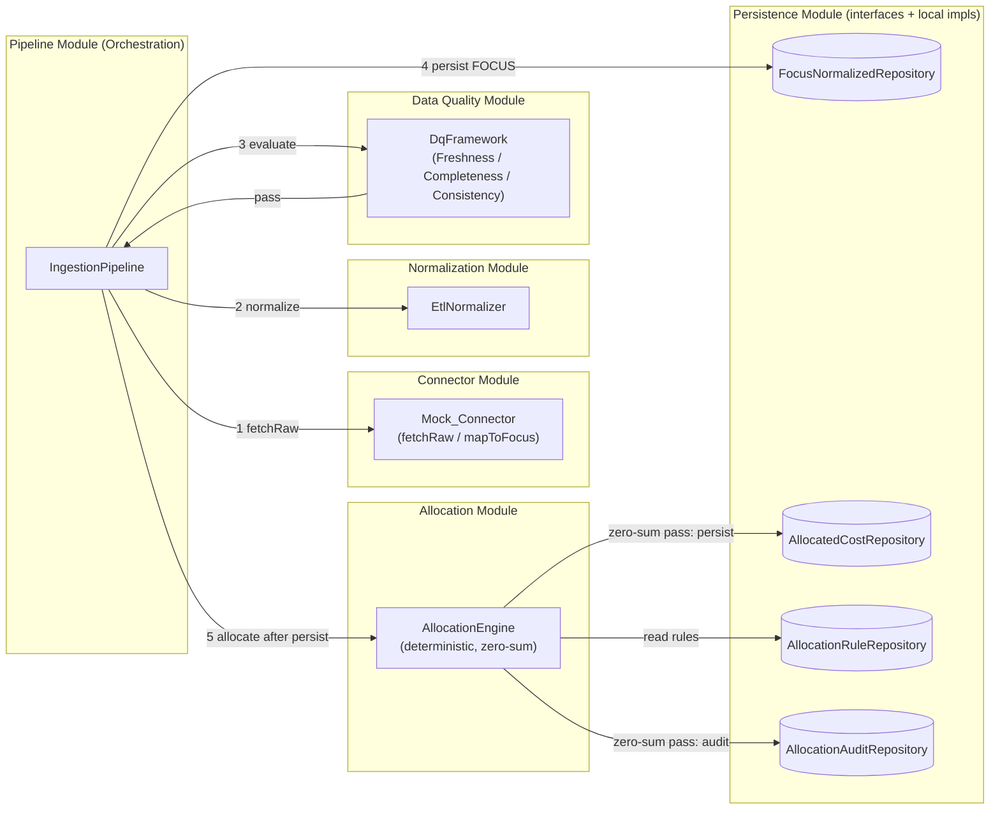

# Design Document

## Overview

The FinOps Core Engine is a NestJS / TypeScript application that implements the deterministic, fail-closed foundation of the FRT FinOps Platform: ingesting cloud billing data, normalizing it to the FOCUS 1.4 standard, gating it through a data quality framework, and allocating cost to teams via a 100% rule-based engine. This phase delivers **framework and contracts**, not infrastructure. All persistence sits behind repository interfaces backed by local/in-memory implementations, so the entire pipeline runs and is fully testable with no ClickHouse, PostgreSQL, or S3 provisioning.

Two principles from the HLD govern the design:

- **Data Correctness First** — no incorrect or incomplete data is ever persisted. The pipeline fails closed: a single failed quality dimension halts the run before any write.
- **Deterministic Allocation** — every cost attribution is rule-based and reproducible. No AI, randomness, or external non-deterministic input participates in any calculation.

The design follows UC-01 (Daily Billing Data Ingestion) and UC-02 (Cost Allocation via Rules Engine) from the SDD, and uses the `FOCUS_NORMALIZED`, `ALLOCATED_COST`, and `ALLOCATION_RULE` models from the ERD as the canonical schema.

### Key Design Decisions

| Decision | Rationale |
| :--- | :--- |
| **Money as decimal, never float** | Financial correctness requires exact arithmetic. We use `decimal.js` (`Decimal` type) for all monetary fields and sums to avoid IEEE-754 drift. Comparisons use a configurable tolerance to absorb legitimate residual currency rounding only — never to mask allocation split errors. |
| **Per-currency grouping (Currency_Group)** | Monetary sums, the consistency check, and the zero-sum check are computed independently per `BillingCurrency` (Currency_Group). Amounts in different currencies are never added into a single total, so a multi-currency period cannot produce a meaningless mixed sum. |
| **Unallocated bucket (`__UNALLOCATED__`)** | A reserved system team receives any cost no rule attributes to a real team — shared-resource idle/overhead, missing telemetry, missing/malformed tags. Orphan cost stays visible and the per-currency zero-sum invariant holds because no cost is silently dropped. |
| **Largest-remainder split (penny allocation)** | When a record's cost is distributed across multiple targets, split amounts are computed with a deterministic largest-remainder method so they sum **exactly** to the source amount with no residual. Rounding tolerance is reserved for residual currency comparison, not for absorbing split drift. |
| **Repository interfaces + local impls** | Core logic depends only on abstract repository contracts (NestJS provider tokens). The in-memory implementation is the default binding; a later phase swaps in a ClickHouse implementation (`FOCUS_NORMALIZED`, `ALLOCATED_COST`) and a PostgreSQL implementation (`ALLOCATION_RULE`, audit) by re-binding the provider — no core logic changes. |
| **Versioned restatement (ingestion version + Allocation_Run)** | `FOCUS_NORMALIZED` writes are stamped with a monotonically increasing ingestion version; re-ingestion (Restatement) retains prior versions and exposes the latest as current. Re-running allocation produces a new Allocation_Run version that supersedes prior runs for reads without mutating them. Restatement is therefore additive and auditable. |
| **Fail-closed pipeline** | DQ runs after normalization and before any persist. Any failed dimension returns a `failed` DQ_Result and the pipeline halts with zero writes. Allocation never starts for a period whose ingestion halted. |
| **Pure allocation engine** | The allocation engine is a pure function of `(FOCUS_Record[], AllocationRule[])`. No I/O, clock, or randomness inside the calculation. The clock and persistence are injected at the orchestration boundary, keeping the core deterministic and property-testable. |
| **Append-only normalized store** | Mirrors the ClickHouse `FOCUS_NORMALIZED` append-only contract from the ERD — prior records are never mutated; successive writes for a period are distinguished by ingestion version. |

## Architecture

### High-Level Flow



### NestJS Module Structure

```
src/
  app.module.ts
  domain/                      # Pure types + validation, no framework deps
    focus-record.ts            # FOCUS_Record type + factory/validator
    allocated-record.ts        # Allocated_Record type
    allocation-rule.ts         # AllocationRule model + RuleType enum
    charge-category.ts         # ChargeCategory enum (Usage|Tax|Credit)
    money.ts                   # Decimal helpers + tolerance comparison
    errors.ts                  # ValidationError, MappingError, DqFailure, AllocationMismatch
  connector/
    connector.module.ts
    connector-adapter.ts       # Abstract ConnectorAdapter (fetchRaw, mapToFocus)
    mock-connector.ts          # Mock_Connector reference implementation
  normalization/
    normalization.module.ts
    etl-normalizer.ts          # EtlNormalizer (raw -> FOCUS_Record)
    column-mapping.ts          # Provider vendor->FOCUS column maps
  data-quality/
    data-quality.module.ts
    dq-framework.ts            # DqFramework orchestrating the three checks
    checks/
      freshness.check.ts
      completeness.check.ts
      consistency.check.ts
  allocation/
    allocation.module.ts
    allocation-engine.ts       # Pure deterministic engine + zero-sum
    rule-matcher.ts            # Priority-ordered matching logic
  persistence/
    persistence.module.ts
    repositories/              # Abstract repository contracts (tokens)
      focus-normalized.repository.ts
      allocated-cost.repository.ts
      allocation-rule.repository.ts
      allocation-audit.repository.ts
    local/                     # In-memory implementations (default bindings)
      in-memory-focus-normalized.repository.ts
      in-memory-allocated-cost.repository.ts
      in-memory-allocation-rule.repository.ts
      in-memory-allocation-audit.repository.ts
  pipeline/
    pipeline.module.ts
    ingestion-pipeline.ts      # Orchestrates fetch -> normalize -> DQ -> persist
    allocation-runner.ts       # Runs allocation only after DQ-passed persist
    clock.ts                   # Injectable Clock (keeps engine pure)
```

Module dependency direction: `pipeline` → (`connector`, `normalization`, `data-quality`, `allocation`, `persistence`). The `domain` module has no dependencies and is imported everywhere. `allocation` and `data-quality` depend on `domain` and `persistence` contracts only.

## Components and Interfaces

All code examples are TypeScript (NestJS). Monetary values use `Decimal` from `decimal.js`.

### Domain Types

```typescript
import Decimal from 'decimal.js';

export enum ChargeCategory {
  Usage = 'Usage',
  Tax = 'Tax',
  Credit = 'Credit',
}

/**
 * Reserved system team that absorbs any cost no rule attributes to a real team
 * (shared-resource idle/overhead, missing telemetry, missing/malformed tags).
 * Keeps the per-currency zero-sum invariant intact and orphan cost visible.
 */
export const UNALLOCATED_TEAM_ID = '__UNALLOCATED__';

export type Tags = Readonly<Record<string, string>>;

export interface FocusRecord {
  readonly billingPeriod: string;        // YYYY-MM-DD (partition key)
  readonly providerName: string;
  readonly subAccountId: string;
  readonly serviceCategory: string;
  readonly serviceName: string;
  readonly resourceId: string;
  readonly resourceName: string;
  readonly chargeCategory: ChargeCategory;
  readonly billedCost: Decimal;          // exact decimal, never float
  readonly effectiveCost: Decimal;
  readonly billingCurrency: string;
  readonly tags: Tags;
  readonly region: string;
  readonly sourceRef: string;            // traceability to raw source (maps to s3_source_path)
}

export interface AllocatedRecord {
  // FOCUS billing fields carried forward
  readonly billingPeriod: string;
  readonly providerName: string;
  readonly subAccountId: string;
  readonly serviceCategory: string;
  readonly serviceName: string;
  readonly resourceId: string;
  readonly billedCost: Decimal;
  readonly effectiveCost: Decimal;
  readonly billingCurrency: string;
  // Allocation enrichment
  readonly teamId: string;
  readonly businessUnit: string;
  readonly environment: string;          // dev | staging | production
  readonly allocationRuleId: string;
  readonly splitMethod: SplitMethod;
  readonly splitRatio: Decimal;          // 1 for non-shared rows; fraction for shared-cost
}
```

### FOCUS_Record Validation

The factory validates required fields (1.5) and constrains `ChargeCategory` (1.6). Missing required fields throw a `ValidationError` naming the field.

```typescript
const REQUIRED_FOCUS_FIELDS = [
  'billingPeriod', 'providerName', 'subAccountId', 'serviceCategory',
  'serviceName', 'resourceId', 'resourceName', 'chargeCategory',
  'billedCost', 'effectiveCost', 'billingCurrency', 'region', 'sourceRef',
] as const;

export function createFocusRecord(input: FocusRecordInput): FocusRecord {
  for (const field of REQUIRED_FOCUS_FIELDS) {
    if (input[field] === undefined || input[field] === null || input[field] === '') {
      throw new ValidationError(`Missing required FOCUS field: ${field}`, field);
    }
  }
  if (!Object.values(ChargeCategory).includes(input.chargeCategory as ChargeCategory)) {
    throw new ValidationError(
      `Invalid ChargeCategory: ${input.chargeCategory}`,
      'chargeCategory',
      input.chargeCategory,
    );
  }
  // billedCost / effectiveCost parsed via toDecimal() to preserve precision
  return Object.freeze({ ...normalized });
}
```

### Money / Decimal Helper

```typescript
import Decimal from 'decimal.js';

export function toDecimal(value: string | number | Decimal): Decimal {
  return new Decimal(value); // strings preferred to avoid float ingress
}

export function sumDecimal(values: readonly Decimal[]): Decimal {
  return values.reduce((acc, v) => acc.plus(v), new Decimal(0));
}

/** Returns true when |a - b| <= tolerance (tolerance >= 0). Tolerance absorbs
 * residual currency rounding ONLY in per-Currency_Group comparisons; it is never
 * used to mask allocation split errors (those are eliminated by largestRemainderSplit). */
export function withinTolerance(a: Decimal, b: Decimal, tolerance: Decimal): boolean {
  return a.minus(b).abs().lessThanOrEqualTo(tolerance);
}

/**
 * Deterministic penny allocation. Distributes `amount` across targets in proportion
 * to `weights` so the returned amounts sum EXACTLY to `amount` with no residual:
 *   1. Quantize each ideal share (amount * weight / sumWeights) DOWN to the currency
 *      scale (floor), tracking each target's fractional remainder.
 *   2. Compute leftover = amount - sum(floors); leftover is a whole number of the
 *      smallest currency unit (pennies).
 *   3. Distribute the leftover pennies one at a time to the targets with the largest
 *      fractional remainder first; ties are broken by ascending target id so the
 *      result is fully reproducible.
 * The number of returned amounts equals the number of weights, and their sum equals
 * `amount` exactly (no tolerance involved).
 */
export function largestRemainderSplit(
  amount: Decimal,
  weights: readonly Decimal[],
  targetIds: readonly string[],
  scale = 2,
): Decimal[] {
  // implementation: floor shares, then assign leftover pennies by (remainder desc, targetId asc)
  return /* deterministic penny-allocated shares summing exactly to `amount` */ [];
}

/** Groups records by BillingCurrency. Monetary sums/checks run per Currency_Group. */
export function groupByCurrency<T extends { readonly billingCurrency: string }>(
  records: readonly T[],
): Map<string, T[]> {
  const groups = new Map<string, T[]>();
  for (const r of records) {
    (groups.get(r.billingCurrency) ?? groups.set(r.billingCurrency, []).get(r.billingCurrency)!).push(r);
  }
  return groups;
}
```

### Connector Adapter Contract

```typescript
export interface RawBillingRecord {
  readonly provider: string;
  readonly billingPeriod: string;
  readonly columns: Readonly<Record<string, string>>; // vendor-native columns
  readonly rawId: string;                              // identity for traceability/errors
}

export abstract class ConnectorAdapter {
  /** Returns raw vendor billing records for a billing period. */
  abstract fetchRaw(billingPeriod: string): Promise<RawBillingRecord[]>;

  /** Transforms raw records into FOCUS_Records (one per mappable record). */
  abstract mapToFocus(raw: readonly RawBillingRecord[]): FocusRecord[];
}
```

The `Mock_Connector` holds a deterministic in-memory fixture keyed by billing period (2.2). `fetchRaw` returns a stable, deep-cloned copy for repeated calls (2.3). `mapToFocus` delegates to the column mapping and throws `MappingError` for unmappable records (2.5).

```typescript
@Injectable()
export class MockConnector extends ConnectorAdapter {
  private readonly fixtures: ReadonlyMap<string, RawBillingRecord[]>;

  async fetchRaw(billingPeriod: string): Promise<RawBillingRecord[]> {
    return deepClone(this.fixtures.get(billingPeriod) ?? []);
  }

  mapToFocus(raw: readonly RawBillingRecord[]): FocusRecord[] {
    return raw.map((r) => mapRawToFocus(r)); // throws MappingError on unmappable
  }
}
```

### ETL Normalizer

```typescript
@Injectable()
export class EtlNormalizer {
  /**
   * Maps raw records to FOCUS_Records using the provider column mapping.
   * Pure and deterministic: identical input -> identical output.
   * Stamps sourceRef for traceability. Throws on invalid mapped values.
   */
  normalize(raw: readonly RawBillingRecord[]): FocusRecord[] {
    return raw.map((record) => {
      const mapping = getColumnMapping(record.provider); // vendor -> FOCUS
      const fields = applyMapping(record, mapping);       // throws ValidationError on bad value
      return createFocusRecord({ ...fields, sourceRef: record.rawId });
    });
  }
}
```

`column-mapping.ts` encodes the ERD's FOCUS Column Mapping table (e.g. AWS `UnblendedCost` → `BilledCost`, Azure `Cost` → `BilledCost`, GCP `project.id` → `SubAccountId`).

### Data Quality Framework

```typescript
export type DqDimension = 'freshness' | 'completeness' | 'consistency';

export interface DqResult {
  readonly status: 'passed' | 'failed';
  readonly failedDimension?: DqDimension;
  readonly detail?: string;
}

export interface DqInput {
  readonly billingPeriod: string;
  readonly rawCount: number;
  /** Raw source totals grouped by BillingCurrency (Currency_Group). */
  readonly rawTotalByCurrency: ReadonlyMap<string, Decimal>;
  readonly normalized: readonly FocusRecord[];
  readonly tolerance: Decimal;
}

@Injectable()
export class DqFramework {
  /**
   * Runs all three checks. Equally blocking: the first failed dimension
   * (evaluated in fixed order) yields status=failed identifying it.
   * Pure evaluation — performs no persistence.
   */
  evaluate(input: DqInput): DqResult {
    const checks: Array<[DqDimension, (i: DqInput) => string | null]> = [
      ['freshness', freshnessCheck],
      ['completeness', completenessCheck],
      ['consistency', consistencyCheck],
    ];
    for (const [dimension, check] of checks) {
      const detail = check(input);
      if (detail !== null) {
        return { status: 'failed', failedDimension: dimension, detail };
      }
    }
    return { status: 'passed' };
  }
}
```

Check semantics:
- **Freshness** (4.3): fails if no normalized record exists for `billingPeriod`.
- **Completeness** (4.4): fails if `normalized.length !== rawCount`.
- **Consistency** (4.5): groups normalized records by `BillingCurrency` (Currency_Group) and, for **each** currency independently, fails unless `withinTolerance(sum(group.billedCost), rawTotalByCurrency.get(currency), tolerance)`. Amounts in different currencies are never summed into a single total; a currency present in one side but absent in the other is a failure naming that currency.

All three are equally blocking (4.2). The framework only evaluates; it never persists. The pipeline decides to halt or proceed based on the `DqResult`.

### Allocation Engine

```typescript
export enum RuleType {
  TagBased = 'tag-based',
  AccountBased = 'account-based',
  SharedCost = 'shared-cost',
}

export enum SplitMethod {
  Proportional = 'proportional',
  Fixed = 'fixed',
  Equal = 'equal',
}

export interface AllocationRule {
  readonly ruleId: string;
  readonly ruleType: RuleType;
  readonly priority: number;            // lower = higher priority
  readonly matchCriteria: MatchCriteria; // {tagKey,tagValue} | {subAccountId} | {sharedMetric}
  readonly targetTeamId: string;
  readonly businessUnit: string;
  readonly environment: string;
  readonly splitMethod: SplitMethod;
  readonly isActive: boolean;
}

export interface AllocationOutcome {
  readonly allocated: AllocatedRecord[];
  /** Zero-sum result per Currency_Group, keyed by BillingCurrency. */
  readonly zeroSumByCurrency: ReadonlyMap<string, ZeroSumResult>;
  /** Overall pass = every Currency_Group passes. */
  readonly zeroSumPassed: boolean;
  readonly ruleSetVersion: string;
}

export interface ZeroSumResult {
  readonly currency: string;
  readonly status: 'passed' | 'failed';
  readonly sourceTotal: Decimal;
  readonly allocatedTotal: Decimal;
  readonly discrepancy: Decimal;        // sourceTotal - allocatedTotal
}

@Injectable()
export class AllocationEngine {
  /**
   * Pure deterministic allocation. For each record, evaluates active rules in
   * priority order (tag-based -> account-based -> shared-cost). First match wins
   * and stops lower-priority evaluation. Any cost no rule attributes to a real
   * team (no match, shared idle/overhead, missing telemetry, missing/malformed
   * tags) is routed to UNALLOCATED_TEAM_ID so no cost is dropped. Multi-target
   * splits use largestRemainderSplit so allocated amounts sum exactly to source.
   * Stamps attribution fields. Verifies zero-sum per Currency_Group. No I/O,
   * clock, or randomness here.
   */
  allocate(
    records: readonly FocusRecord[],
    rules: readonly AllocationRule[],
    tolerance: Decimal,
  ): AllocationOutcome {
    const ordered = [...rules.filter((r) => r.isActive)]
      .sort(byPriorityThenRuleId); // total order -> determinism
    const allocated = records.flatMap((rec) => applyRules(rec, ordered)); // unmatched -> UNALLOCATED_TEAM_ID
    const zeroSumByCurrency = checkZeroSumByCurrency(records, allocated, tolerance);
    const zeroSumPassed = [...zeroSumByCurrency.values()].every((z) => z.status === 'passed');
    return { allocated, zeroSumByCurrency, zeroSumPassed, ruleSetVersion: hashRuleSet(ordered) };
  }
}
```

Priority resolution (5.1–5.4): rules are sorted by `(priority asc, ruleId asc)` to guarantee a **total, deterministic order** even when priorities tie. The first matching rule of the highest priority wins; tag-based rules are configured with lower priority numbers than account-based, which are lower than shared-cost. Shared-cost rules split a record across teams using `largestRemainderSplit`; the allocated amounts sum to the source `billedCost` **exactly** (no residual), preserving zero-sum per record.

Unallocated routing (5.5): when no rule attributes a record — or a portion of a shared split (e.g. missing telemetry weight, missing/malformed tag, shared-resource idle/overhead) — to a real team, that cost is attributed to `UNALLOCATED_TEAM_ID`. This keeps orphan cost visible and guarantees the per-currency zero-sum holds because nothing is silently dropped.

Largest-remainder splits (5.6): every multi-target distribution goes through `largestRemainderSplit(amount, weights, targetIds)`, so the split amounts sum to the source `billedCost` with no rounding residual. Tolerance is therefore reserved for residual currency comparison only, not for absorbing split drift.

Zero-sum (5.10): computed **per Currency_Group**. For each `BillingCurrency`, `sum(allocated.billedCost)` (including amounts in the Unallocated_Bucket) must equal `sum(records.billedCost)` for that currency within tolerance; amounts in different currencies are never summed together. On failure (5.11) the engine marks the failing currency's `ZeroSumResult.status = 'failed'` with the discrepancy and the currency, and the runner persists nothing.

### Repository Interfaces

```typescript
export abstract class FocusNormalizedRepository {
  /**
   * Append-only: never mutates previously written records (6.4). Each call records
   * a new ingestion version for the period and returns it; prior versions are
   * retained. Re-ingestion (Restatement) adds a higher version (6.5).
   */
  abstract append(billingPeriod: string, records: readonly FocusRecord[]): Promise<number>; // returns ingestionVersion
  /** Reads the latest ingestion version as the current data for the period (6.5). */
  abstract findByPeriod(billingPeriod: string): Promise<FocusRecord[]>;
  abstract countByPeriod(billingPeriod: string): Promise<number>;
  /** The latest ingestion version recorded for the period (0 if none). */
  abstract latestVersion(billingPeriod: string): Promise<number>;
}

export abstract class AllocatedCostRepository {
  /**
   * Records allocation results under a NEW Allocation_Run version, superseding
   * prior runs for reads without mutating them (6.6). Returns the new run version.
   */
  abstract save(billingPeriod: string, records: readonly AllocatedRecord[]): Promise<number>; // returns allocationRunVersion
  /** Reads the latest Allocation_Run as the current allocation for the period (6.6). */
  abstract findByPeriod(billingPeriod: string): Promise<AllocatedRecord[]>;
  abstract latestRunVersion(billingPeriod: string): Promise<number>;
}

export abstract class AllocationRuleRepository {
  abstract findActiveOrderedByPriority(): Promise<AllocationRule[]>;
}

export interface AllocationAuditEntry {
  readonly timestamp: string;
  readonly billingPeriod: string;
  readonly ruleSetVersion: string;
  readonly allocationRunVersion: number;   // the Allocation_Run this entry describes (5.12)
  readonly recordCount: number;
}

export abstract class AllocationAuditRepository {
  abstract record(entry: AllocationAuditEntry): Promise<void>;
  abstract findByPeriod(billingPeriod: string): Promise<AllocationAuditEntry[]>;
}
```

Each abstract class is a NestJS injection token bound to its in-memory implementation in `persistence.module.ts`. The in-memory `FocusNormalizedRepository.append` pushes a new ingestion-version layer onto a per-period structure and never rewrites existing entries (append-only, mirroring ClickHouse); `findByPeriod` returns the latest version. `AllocatedCostRepository.save` stores results under a new Allocation_Run version and `findByPeriod` returns the latest run. **Swap path:** a later phase provides `ClickHouseFocusNormalizedRepository` / `ClickHouseAllocatedCostRepository` and `PostgresAllocationRuleRepository` / `PostgresAllocationAuditRepository` and re-binds the tokens; no core logic changes.

### Pipeline Orchestration

```typescript
@Injectable()
export class IngestionPipeline {
  constructor(
    private readonly connector: ConnectorAdapter,
    private readonly normalizer: EtlNormalizer,
    private readonly dq: DqFramework,
    private readonly focusRepo: FocusNormalizedRepository,
    private readonly allocationRunner: AllocationRunner,
    private readonly config: EngineConfig, // tolerance, ruleSet, etc.
  ) {}

  async run(billingPeriod: string): Promise<PipelineResult> {
    // 1. fetch
    const raw = await this.connector.fetchRaw(billingPeriod);
    // 2. normalize
    const normalized = this.normalizer.normalize(raw);
    // 3. data quality (before any persist)
    const dqResult = this.dq.evaluate({
      billingPeriod,
      rawCount: raw.length,
      rawTotalByCurrency: rawTotalByCurrency(raw), // grouped per Currency_Group
      normalized,
      tolerance: this.config.tolerance,
    });
    if (dqResult.status === 'failed') {
      // fail-closed: no write, no allocation (4.7, 4.8, 7.3)
      return { status: 'halted', stage: 'data-quality', dqResult };
    }
    // 4. persist (only on DQ pass) (4.9); append records a new ingestion version (6.4, 6.5)
    const ingestionVersion = await this.focusRepo.append(billingPeriod, normalized);
    // 5. allocation runs only after persisted normalized data, against the latest
    //    ingestion version, producing a new Allocation_Run (7.2, 7.4)
    const allocation = await this.allocationRunner.run(billingPeriod);
    return { status: 'completed', dqResult, ingestionVersion, allocation };
  }
}
```

```typescript
@Injectable()
export class AllocationRunner {
  constructor(
    private readonly engine: AllocationEngine,
    private readonly focusRepo: FocusNormalizedRepository,
    private readonly ruleRepo: AllocationRuleRepository,
    private readonly allocatedRepo: AllocatedCostRepository,
    private readonly auditRepo: AllocationAuditRepository,
    private readonly clock: Clock,
    private readonly config: EngineConfig,
  ) {}

  async run(billingPeriod: string): Promise<AllocationResult> {
    const records = await this.focusRepo.findByPeriod(billingPeriod); // latest ingestion version
    const rules = await this.ruleRepo.findActiveOrderedByPriority();
    const outcome = this.engine.allocate(records, rules, this.config.tolerance);

    if (!outcome.zeroSumPassed) {
      // fail-closed: no ALLOCATED_COST write; identify the failing currency (5.11)
      return { status: 'mismatch', zeroSumByCurrency: outcome.zeroSumByCurrency };
    }
    // save under a new Allocation_Run version, superseding prior runs for reads (5.12, 6.6)
    const allocationRunVersion = await this.allocatedRepo.save(billingPeriod, outcome.allocated);
    await this.auditRepo.record({
      timestamp: this.clock.now(),
      billingPeriod,
      ruleSetVersion: outcome.ruleSetVersion,
      allocationRunVersion,
      recordCount: outcome.allocated.length,
    });
    return { status: 'completed', allocationRunVersion, count: outcome.allocated.length };
  }
}
```

The `Clock` is injected so the engine itself stays pure; only the runner stamps the audit timestamp.

## Data Models

The canonical models mirror the ERD:

- **FocusRecord** ↔ `FOCUS_NORMALIZED` (ClickHouse, append-only). `sourceRef` ↔ `s3_source_path`. Successive writes for a period are distinguished by an **ingestion version**; the latest version is the current data (Restatement retains prior versions).
- **AllocatedRecord** ↔ `ALLOCATED_COST` (ClickHouse). Carries `teamId` (may be `__UNALLOCATED__`), `businessUnit`, `environment`, `allocationRuleId`, `splitMethod`, `splitRatio`. Results are stored under an **Allocation_Run version**; the latest run is the current allocation.
- **AllocationRule** ↔ `ALLOCATION_RULE` (PostgreSQL OLTP). `priority` int, lower = higher priority.
- **AllocationAuditEntry** ↔ allocation-run audit (PostgreSQL append-only audit semantics). Carries the `allocationRunVersion` it describes.

Monetary fields (`billedCost`, `effectiveCost`, `splitRatio`) are `Decimal`. Persistence-layer serialization keeps them as decimal strings to preserve precision when the local impl is later replaced by ClickHouse `Decimal` columns.

## Error Handling

| Scenario | Handling | Requirement |
| :--- | :--- | :--- |
| Missing required FOCUS field | `ValidationError(field)` thrown by `createFocusRecord` | 1.5 |
| Invalid `ChargeCategory` value | `ValidationError('chargeCategory', value)` | 1.6 |
| Unmappable raw record | `MappingError(rawId)` from `mapToFocus` | 2.5 |
| Invalid mapped value during normalization | `ValidationError(field, value)` | 3.5 |
| DQ dimension failed | `DqResult{status:'failed', failedDimension, detail}`; pipeline returns `halted`, no writes | 4.6, 4.7, 4.8 |
| Allocation zero-sum mismatch (per currency) | `ZeroSumResult{currency, status:'failed', discrepancy}` for the failing Currency_Group; runner returns `mismatch` identifying the currency, no `ALLOCATED_COST` write | 5.11 |
| Ingestion halted on DQ | Allocation never invoked for the period | 7.3 |

Fail-closed guarantee: the pipeline performs **no** persistence on any DQ failure (not even a partial subset), and the allocation runner performs **no** `ALLOCATED_COST` write on a zero-sum mismatch. Errors raised inside normalization/mapping abort the run before DQ and therefore before any persist.

## Testing Strategy

A property is a characteristic that should hold across all valid executions. Property tests use **fast-check** (TypeScript) with a minimum of **100 iterations** per property. Decimal generators produce monetary values as strings fed into `Decimal` to exercise precision. Unit and integration tests cover specific examples, ordering, and structural contracts.

### Unit / Example Tests
- FOCUS_Record and Allocated_Record field presence (1.1, 1.3, 1.4).
- Connector contract implements `fetchRaw` and `mapToFocus`; mock returns data with no network (2.1, 2.2).
- Repository interfaces exist with working in-memory impls (6.1, 6.2).
- Pipeline call order: fetch → normalize → DQ → persist, asserted via a call-order spy (4.1, 7.1).

### Property-Based Tests
Each property test is tagged **Feature: finops-core-engine, Property {n}: {text}** and references its design property. Generators build random FOCUS_Records, raw records, rule sets, and decimal amounts.

### Integration Tests
- End-to-end pipeline on a DQ-passing fixture: stores populated, audit entry written.
- End-to-end pipeline on a DQ-failing fixture: both stores empty, allocation never called.

## Correctness Properties

*A property is a characteristic or behavior that should hold true across all valid executions of a system — a formal statement about what the system should do. Properties serve as the bridge between human-readable specifications and machine-verifiable correctness guarantees.*

### Property 1: Monetary precision is preserved

*For any* decimal monetary string, constructing a FOCUS_Record and reading back `billedCost` and `effectiveCost` yields a value exactly equal to the input with no precision loss or float drift.

**Validates: Requirements 1.2**

### Property 2: Missing required field is rejected by name

*For any* FOCUS_Record input with exactly one required FOCUS field omitted, construction fails with a validation error whose identified field equals the omitted field.

**Validates: Requirements 1.5**

### Property 3: ChargeCategory domain constraint

*For any* string value, FOCUS_Record construction succeeds with respect to charge category if and only if the value is one of Usage, Tax, or Credit.

**Validates: Requirements 1.6**

### Property 4: Connector fetch determinism

*For any* billing period, invoking `fetchRaw` twice on the Mock_Connector returns deeply-equal raw record sets.

**Validates: Requirements 2.3**

### Property 5: Mapping is size-preserving

*For any* list of mappable raw records, `mapToFocus` returns exactly one FOCUS_Record per input record (output length equals input length).

**Validates: Requirements 2.4**

### Property 6: Unmappable record is rejected with identity

*For any* raw record lacking data required by its provider mapping, `mapToFocus` throws a mapping error that identifies the offending raw record.

**Validates: Requirements 2.5**

### Property 7: Normalization conformance and traceability

*For any* list of valid raw records, every record produced by the ETL_Normalizer conforms to the FOCUS 1.4 model and carries a non-empty source traceability reference to its raw source.

**Validates: Requirements 3.1, 3.2**

### Property 8: Mapping fidelity

*For any* raw record and its provider column mapping, each FOCUS field of the produced record equals the value of the mapped source column.

**Validates: Requirements 3.3**

### Property 9: Normalization determinism

*For any* list of raw records, normalizing the same input across repeated runs produces identical FOCUS_Record output.

**Validates: Requirements 3.4**

### Property 10: Invalid mapped value is rejected with field and value

*For any* raw record containing a value invalid for its mapped FOCUS field, normalization throws an error identifying both the field and the offending value.

**Validates: Requirements 3.5**

### Property 11: Each DQ dimension passes iff its condition holds (consistency per currency)

*For any* DQ input, the freshness check passes iff at least one normalized record exists for the period, the completeness check passes iff the normalized count equals the raw count, and the consistency check passes iff — for **every** Currency_Group independently — the normalized BilledCost sum for that currency is within tolerance of the raw total for that same currency. Amounts in different currencies are never combined into one total.

**Validates: Requirements 4.3, 4.4, 4.5**

### Property 12: Any failed dimension yields a failed result identifying it

*For any* DQ input in which exactly one dimension's condition is violated, the DQ_Result has status failed and its failing dimension equals the violated dimension — each dimension being equally blocking.

**Validates: Requirements 4.2, 4.6**

### Property 13: Fail-closed on DQ failure

*For any* billing period whose DQ evaluation fails, after the pipeline runs both the FOCUS_NORMALIZED and ALLOCATED_COST stores remain empty (no full or partial write).

**Validates: Requirements 4.7, 4.8**

### Property 14: Persistence on DQ pass

*For any* billing period whose DQ evaluation passes, after the pipeline runs the FOCUS_NORMALIZED store contains exactly the normalized records for that period.

**Validates: Requirements 4.9**

### Property 15: Priority-ordered attribution

*For any* FOCUS_Record and active rule set, the allocated team is determined by the highest-priority matching rule, where tag-based rules take precedence over account-based rules, which take precedence over the shared-cost rule; a record matched by a tag rule is never attributed by a lower-priority rule.

**Validates: Requirements 5.1, 5.2, 5.3, 5.4**

### Property 16: Unallocated bucket catches all otherwise-unattributed cost

*For any* set of FOCUS_Records and active rule set — including records no rule matches, records with missing/malformed tags, and shared-cost records with missing telemetry needed for a split — every unit of cost that is not attributed to a real team is attributed to `__UNALLOCATED__`, so no cost is dropped and the per-currency zero-sum still holds.

**Validates: Requirements 5.5**

### Property 17: Largest-remainder split is exact and deterministic

*For any* source amount and set of split weights with target ids, `largestRemainderSplit` returns one amount per target whose sum equals the source amount exactly (no residual), and produces an identical distribution across repeated runs — with leftover pennies assigned by largest fractional remainder first and ties broken by ascending target id.

**Validates: Requirements 5.6**

### Property 18: Attribution fields are stamped

*For any* allocated record, the fields TeamID, BusinessUnit, Environment, allocation_rule_id, split_method, and split_ratio are all populated.

**Validates: Requirements 5.7**

### Property 19: Allocation determinism

*For any* set of FOCUS_Records and rule set, allocating the same input across repeated runs produces identical Allocated_Record output — including identical remainder assignment under largest-remainder splits — using only configured rules with no non-deterministic or AI input.

**Validates: Requirements 5.8, 5.9**

### Property 20: Zero-sum invariant per currency

*For any* set of FOCUS_Records, the Zero_Sum_Check is computed per Currency_Group: within each BillingCurrency the sum of allocated BilledCost (including Unallocated_Bucket amounts) equals the sum of source BilledCost for that currency. The check is exact for split-produced amounts; tolerance absorbs only residual currency rounding, and amounts in different currencies are never summed together.

**Validates: Requirements 5.10**

### Property 21: Fail-closed on zero-sum mismatch identifies currency

*For any* allocation whose zero-sum check fails for some Currency_Group, the ALLOCATED_COST store remains empty and the engine emits an allocation mismatch result identifying the failing currency and the discrepancy.

**Validates: Requirements 5.11**

### Property 22: Persistence and audit on zero-sum pass

*For any* allocation whose zero-sum check passes for all Currency_Groups, after the run the ALLOCATED_COST store contains the allocated records under a new Allocation_Run version and the audit store contains one entry with a timestamp, the rule set version, the Allocation_Run version, and a record count equal to the number of allocated records.

**Validates: Requirements 5.12**

### Property 23: Append-only normalized store

*For any* two successive write batches to the FOCUS_NORMALIZED store for the same billing period, the records from the first batch remain unchanged after the second write.

**Validates: Requirements 6.4**

### Property 24: Restatement retains prior version and exposes latest

*For any* billing period re-ingested by a Restatement, the FOCUS_NORMALIZED store retains the prior ingestion version unchanged and `findByPeriod` returns the records of the latest ingestion version as the current data.

**Validates: Requirements 6.5**

### Property 25: Re-allocation supersedes prior run without mutating it

*For any* billing period whose allocation is re-run, the ALLOCATED_COST store records a new Allocation_Run version, leaves the prior run's records unchanged, and `findByPeriod` returns the latest Allocation_Run as the current allocation.

**Validates: Requirements 6.6, 7.4**

### Property 26: Allocation runs only after persisted ingestion

*For any* successful ingestion run, allocation reads the persisted normalized data and begins only after persistence has completed.

**Validates: Requirements 7.2**

### Property 27: No allocation when ingestion halts

*For any* billing period whose ingestion halts due to a failed DQ_Result, the allocation engine is never invoked and the ALLOCATED_COST store remains empty.

**Validates: Requirements 7.3**
