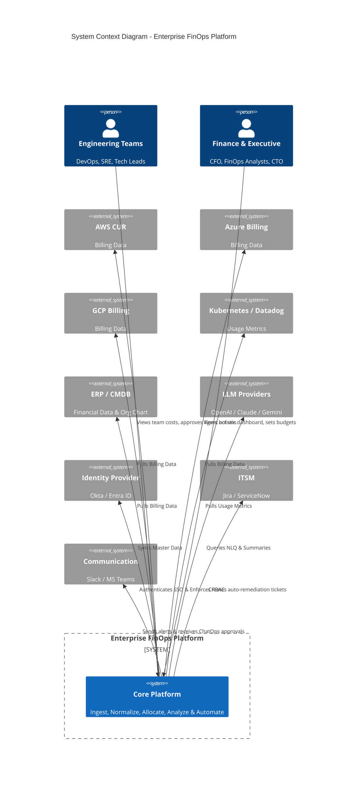
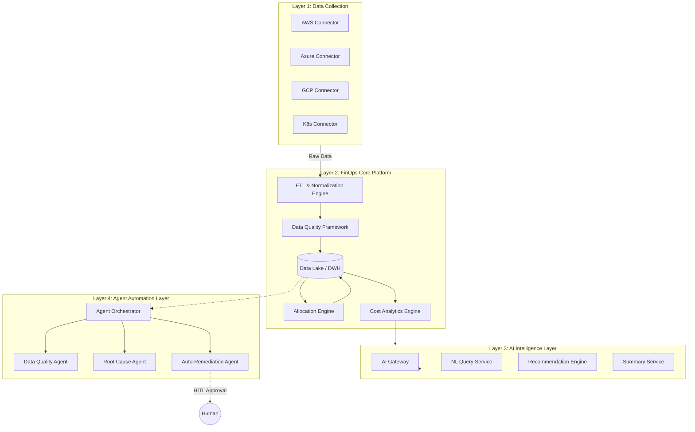
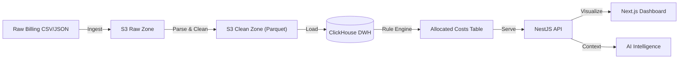
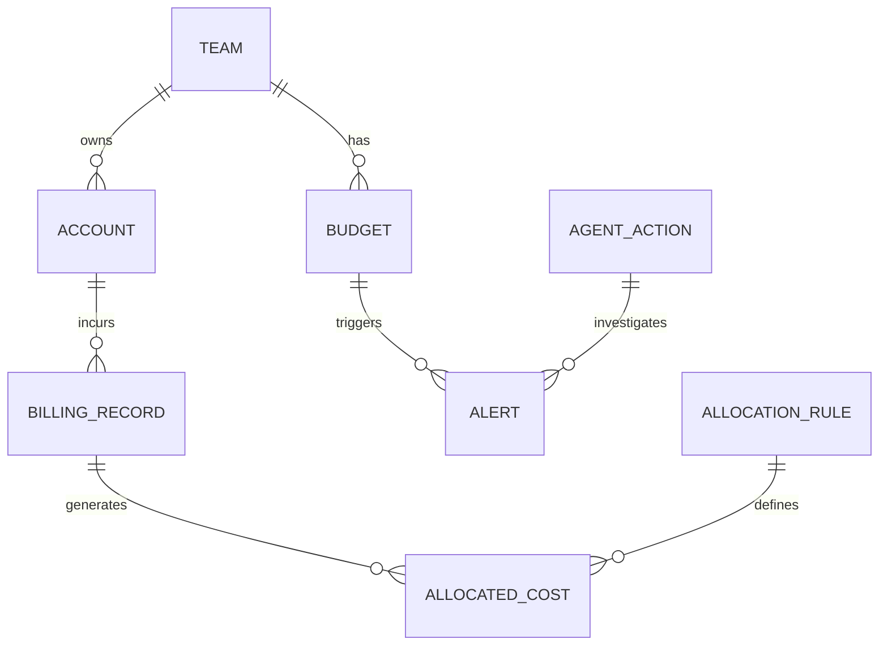
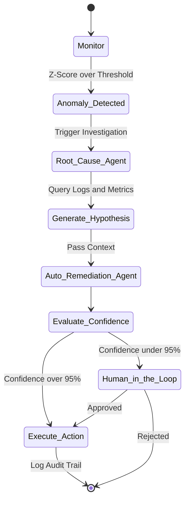

# Enterprise FinOps Platform - High Level Design (HLD)

## 1. Executive Summary
This High Level Design (HLD) outlines the architecture for an Enterprise FinOps Platform designed to ingest, normalize, allocate, and optimize cloud financial data across multi-cloud environments (AWS, Azure, GCP) and internal systems (Kubernetes, Datadog, CMDB, ERP). The architecture strictly enforces a separation between deterministic financial calculations and AI-driven intelligence, utilizing an Agentic framework for automated remediation, root cause analysis, and data quality assurance with robust Human-in-the-Loop (HITL) safeguards.

## 2. Product Vision
To provide a single pane of glass for all cloud and infrastructure expenditures, empowering engineering teams to take ownership of their costs while giving finance and executive leadership absolute confidence in data accuracy, allocation rules, and chargeback mechanisms.

## 3. Business Goals
* **Visibility:** Unified view of multi-cloud and internal infrastructure costs.
* **Accountability:** 100% allocation of costs via deterministic chargeback/showback.
* **Governance:** Proactive budget alerting and anomaly detection.
* **Optimization:** Actionable, data-driven recommendations to reduce waste.
* **Automation:** Agentic workflows to resolve data anomalies and implement optimizations safely.

## 4. Architecture Principles
> [!IMPORTANT]
> **Principle 1: Data Correctness First**
> FinOps data is financial data. Accuracy, auditability, traceability, and reproducibility strictly override AI capabilities. Every allocation and transformation must be deterministically traceable.

> [!WARNING]
> **Principle 2: AI Must Not Participate in Cost Calculation**
> AI/LLMs must NEVER be part of billing calculation, allocation logic, or the financial source of truth. These must remain 100% rule-based.

> [!NOTE]
> **Principle 3: AI as Intelligence Layer**
> AI is restricted to summarization, forecasting, recommendations, and natural language querying on top of already validated, normalized data.

> [!CAUTION]
> **Principle 4: Agentic Automation**
> Agents are used for anomaly investigation and auto-remediation. All agent actions require a confidence score, a strict audit trail, and Human-in-the-Loop (HITL) approval when confidence falls below the defined threshold.

## 5. Functional Requirements
* Multi-cloud ingestion (AWS CUR, Azure Export, GCP Billing).
* Kubernetes and SaaS cost correlation.
* Rule-based Cost Allocation Engine (Tag-based, Account-based, Shared-cost).
* AI-driven Cost Summary and Executive Reporting.
* Agentic Data Quality monitoring and Auto-Remediation with HITL.
* Natural Language Query (NLQ) interface for cost exploration.

## 6. Non-Functional Requirements
* **Scalability:** Handle millions of billing records per day.
* **Latency:** Near real-time anomaly detection; daily batch aggregations.
* **Auditability:** Immutable event sourcing for all allocation rules and agent actions.
* **Security:** SOC2 compliant, RBAC at the row-level (teams only see their costs).

## 7. System Context Diagram

### System Context Analysis
The C4 Context diagram above illustrates the extended ecosystem that the Enterprise FinOps Platform must interact with:
*   **Separation of Actors:** The **Engineering Teams** only interact with data scoped to their domain and respond to optimization requests. Conversely, the **Finance & Executive** group has a holistic view for organizational budget planning.
*   **Identity Integration (IdP):** To enforce "Row-level Security" (preventing teams from viewing other teams' costs), the system must tightly integrate with an enterprise SSO provider (Okta/Entra ID).
*   **Operational Ecosystem (ITSM & Chat):** Rather than just being a read-only dashboard, the FinOps Platform directly pushes detected anomalies and optimization recommendations as Tickets to **Jira/ServiceNow** to enforce resolution KPIs. Simultaneously, it leverages **Slack/Teams** for rapid Human-in-the-Loop (HITL) approvals via ChatOps.

## 8. High Level Architecture Diagram

## 9. Component Architecture

The system is designed following a Microservices architecture (or a Modular Monolith in the initial phase), comprising the following core services:

### Core Platform Services
*   **Data Ingestion Service:** Responsible for securely connecting to AWS/Azure/GCP APIs to pull raw billing data on scheduled cron jobs. Handles API rate limits, pagination, and retry mechanisms.
*   **ETL & Normalization Service:** Processes high-volume raw data. Strips unnecessary columns, maps vendor-specific terminologies to the unified FOCUS standard, and outputs Parquet files.
*   **Allocation & Rules Engine Service:** The "heart" of the allocation system. Runs deterministic rules against normalized data to accurately calculate costs belonging to specific Teams/Projects based on Tags or CMDB mappings.
*   **Analytics & Query API (OLAP Service):** Provides high-speed data read APIs. Specifically optimized to execute aggregations on ClickHouse, serving UI dashboard charts with sub-second latency.
*   **Governance & Alerting Service:** Continuously monitors actual costs against established Budgets. Emits events to Kafka/SQS when thresholds or anomalies are detected.

### Tech & AI Stack
*   **Backend Framework:** **NestJS (Node.js)** chosen for its strict TypeScript typing, modular architecture, and excellent dependency injection, vital for enterprise-grade maintainability.
*   **Frontend Framework:** **Next.js + React** for SSR dashboards and highly responsive UI.
*   **AI Gateway & Agent Orchestrator:** A centralized proxy service (e.g., LiteLLM) to route requests between OpenAI, Claude, and Gemini. Accompanied by an Orchestrator service (using LangGraph or Temporal) to manage Agent lifecycles, contexts, and Human-in-the-Loop workflows.
## 10. Data Flow Diagrams

### Data Flow Analysis
The diagram above illustrates the movement of data from its raw form to its final analytical value:
1.  **Ingestion:** Massive CSV/JSON files from Cloud Providers are ingested into the `S3 Raw Zone` in their original state for reference storage.
2.  **Transformation:** Raw data is cleaned, unnecessary columns are stripped, and it is converted to the FOCUS standard before being saved as `Parquet` (a columnar compression format) in the `S3 Clean Zone`.
3.  **Warehousing:** Parquet data is rapidly loaded into the Data Warehouse (`ClickHouse`) to serve high-speed OLAP queries.
4.  **Allocation & Serving:** The Allocation Engine applies rules to allocate costs, storing the results in the `Allocated Cost` table. Finally, the `NestJS API` serves this data to the user dashboard and provides context for the AI layer.

## 11. Domain Model

### Domain Model Explanation
The core FinOps Domain Model focuses on the relationship between Ownership (Team) and Cost:
*   **Ownership & Limits:** A `TEAM` (Engineering/Product group) owns multiple `ACCOUNT`s (Cloud Accounts/Subscriptions) and is assigned multiple `BUDGET`s.
*   **Raw Costs & Allocation:** `ACCOUNT`s incur `BILLING_RECORD`s (Raw cost records). Each `BILLING_RECORD` is evaluated against an `ALLOCATION_RULE`, generating one or more `ALLOCATED_COST` records (actual costs attributed to a Team).
*   **Alerts & Automation:** When costs exceed predefined limits, a `BUDGET` triggers an `ALERT`. Finally, AI `AGENT_ACTION`s are tasked with investigating these Alerts.

## 12. Data Model Overview
* **Billing_Raw:** Immutable, append-only raw data from providers.
* **FOCUS_Normalized:** Data mapped to the FOCUS (FinOps Open Cost & Usage Specification) standard schema (e.g., `BilledCost`, `ChargeCategory`, `ProviderName`).
* **Allocated_Cost:** Enriched records containing mapped `TeamID`, `BusinessUnit`, and `Environment`.
* **Audit_Log:** Immutable log of all allocation rule changes and Agent actions.

## 13. ETL Architecture
* **Extract:** Scheduled cron jobs (via Temporal) trigger Connectors to pull data from S3 buckets (AWS CUR) or APIs (Azure/GCP).
* **Transform:** Node.js streams process raw files, mapping vendor-specific columns to the FOCUS standard.
* **Load:** Processed data is saved as Parquet files in S3 and bulk-inserted into ClickHouse for fast OLAP querying.

## 14. Allocation Engine Design
The Allocation Engine operates strictly deterministically.
1. **Tag-based:** Reads standard tags (e.g., `CostCenter`, `Owner`).
2. **Account-based:** Maps Cloud Account IDs directly to Teams via CMDB sync.
3. **Shared-cost:** Distributes costs of shared resources (e.g., K8s clusters, shared databases) based on telemetry usage metrics proportionally.

## 15. Data Quality Framework
Runs post-ETL to ensure Principle 1 (Data Correctness):
* **Freshness:** Asserts all expected daily billing files have arrived.
* **Completeness:** Asserts row counts match expected provider checksums.
* **Consistency:** Asserts `Allocated_Cost` sum equals `Raw_Cost` sum (Zero-sum game).

## 16. Governance Framework
* **Budgets:** Hierarchical budgets (Org -> Department -> Team).
* **Alerting:** Real-time threshold alerts (Kafka-driven).
* **RBAC:** Strict row-level security ensuring teams only view their respective data slices.

## 17. AI Intelligence Architecture
The AI layer accesses data *only* through secure read-only APIs returning aggregated ClickHouse data.
* **Boundaries:** AI cannot execute SQL directly (to prevent prompt injection exposing other teams' costs). It uses predefined API tools.
* **Hallucination Prevention:** Context window is heavily constrained by injecting factual, aggregated JSON summaries. Temperature is set to 0.0 for analytical tasks.

## 18. Agent Architecture

## 19. Security Architecture
* **Data Encryption:** AES-256 for data at rest (S3, ClickHouse). TLS 1.3 in transit.
* **Secret Management:** HashiCorp Vault or AWS Secrets Manager for Cloud API keys.
* **AI Privacy:** Zero data-retention policies negotiated with LLM providers. PII/Financial numbers masked before hitting third-party LLM APIs where possible.

## 20. Scalability Architecture
* **Compute:** NestJS microservices deployed on Kubernetes, auto-scaling based on CPU/Memory metrics.
* **Storage:** Decoupled storage and compute. S3 handles infinite raw data storage; ClickHouse scales horizontally using sharding for high-speed analytical reads.

## 21. Observability Architecture
* **Metrics & Tracing:** OpenTelemetry instrumented across all NestJS services.
* **Monitoring:** Datadog / Prometheus + Grafana.
* **Agent Observability:** LangSmith / Traceloop used to monitor Agent reasoning steps, tool usage, and token consumption.

## 22. Deployment Architecture
* **CI/CD:** GitHub Actions deploying Helm charts to Kubernetes.
* **Infrastructure as Code:** Terraform used to provision S3, ClickHouse clusters, Kafka, and networking.

---

## 23. ADRs (Architecture Decision Records)

### ADR 1: Database - PostgreSQL vs ClickHouse
* **Decision:** **Hybrid Approach**. PostgreSQL for OLTP (metadata, allocation rules, user state). **ClickHouse** for OLAP (billing records, analytics).
* **Reasoning:** FinOps requires querying millions of rows spanning months to aggregate costs. PostgreSQL struggles with OLAP aggregations at this scale. ClickHouse's columnar format delivers sub-second analytical queries.
* **Trade-off:** Managing two database technologies increases operational overhead.

### ADR 2: Data Lake & DWH - S3/Parquet + ClickHouse vs Snowflake
* **Decision:** **S3 + Parquet + ClickHouse**.
* **Reasoning:** Snowflake is powerful but charges per compute second. Running frequent micro-batch ingestions and continuous AI Agent queries on Snowflake would result in astronomical FinOps platform costs. ClickHouse provides better cost-to-performance ratio for this specific workload.

### ADR 3: Messaging - Kafka vs SQS
* **Decision:** **Kafka** for Data Streams, **SQS** for Task Queues.
* **Reasoning:** Kafka is used for streaming raw billing data where replayability and high throughput are required. SQS is used for triggering isolated ETL jobs and Agent tasks where simple dead-letter queue (DLQ) mechanics suffice.

### ADR 4: Orchestration - Airflow vs Temporal
* **Decision:** **Temporal**.
* **Reasoning:** While Airflow is standard for data pipelines, our architecture relies heavily on Agentic workflows (Layer 4). Temporal provides superior state management, robust retry mechanisms, and native support for suspending workflows to await **Human-in-the-Loop (HITL)** approval before auto-remediation.

---

## 24. Risks & Mitigations
| Risk | Impact | Mitigation |
| :--- | :--- | :--- |
| **LLM Hallucinating Allocation** | Critical | Enforce Principle 2. AI strictly isolated from calculation layer. |
| **Agent Executing Destructive Action** | High | Mandatory HITL via Temporal for any action altering infrastructure state. |
| **Cloud API Rate Limits** | Medium | Implement exponential backoff in ETL Connectors; use caching. |
| **Runaway AI API Costs** | Medium | Implement token budgets per Agent; fallback to cheaper models (e.g., GPT-3.5/Claude Haiku) for basic triage. |

## 25. Future Roadmap
* **Phase 1:** Multi-cloud ingestion, Normalization (FOCUS), Rule-based Allocation.
* **Phase 2:** BI Dashboards, Budgeting, Basic Alerting.
* **Phase 3:** AI Intelligence Layer (NLQ, Summaries).
* **Phase 4:** Agent Automation Layer (Root Cause Analysis, HITL Auto-remediation).
* **Phase 5:** Deep SaaS Integrations (Datadog, Snowflake, MongoDB Atlas billing).
