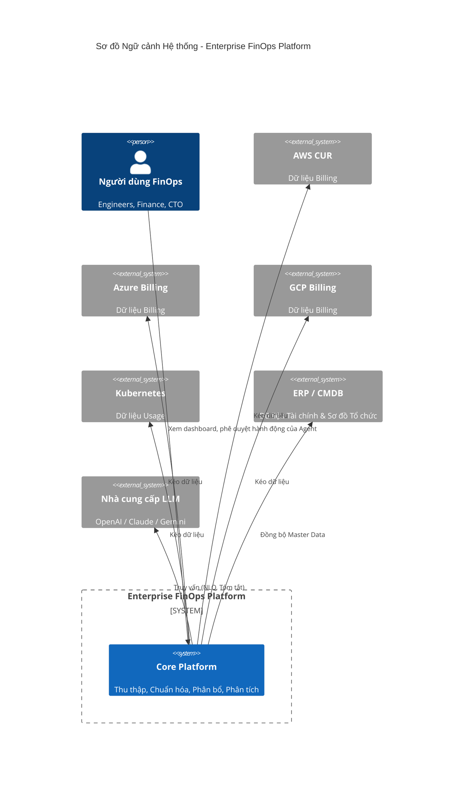
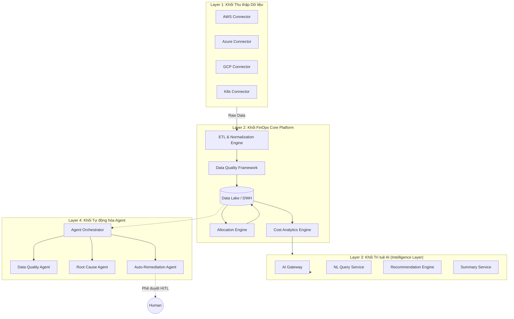
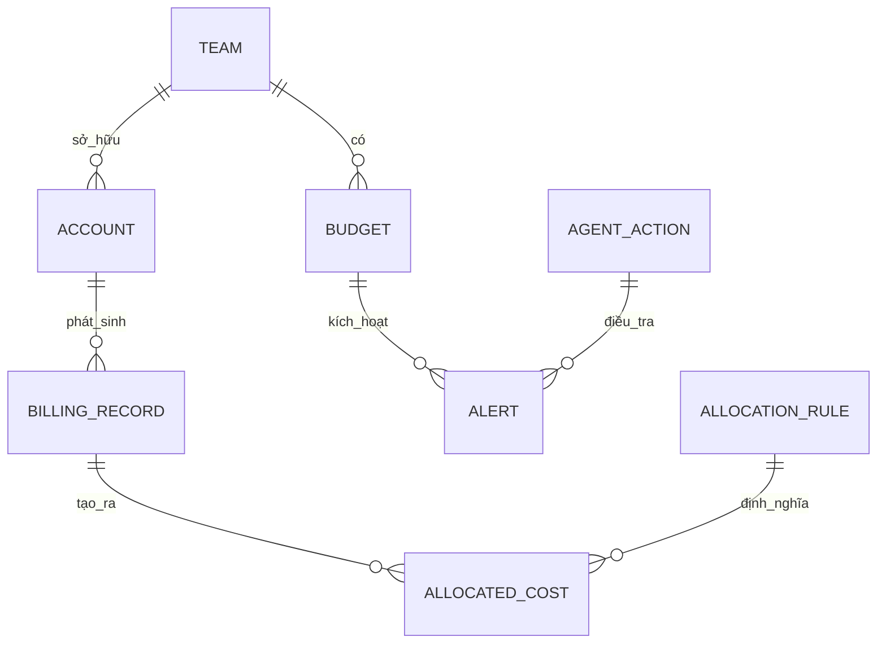
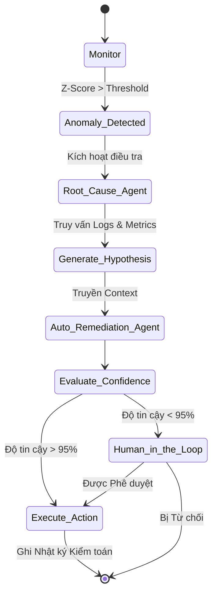

# Enterprise FinOps Platform - High Level Design (HLD)

## 1. Tóm tắt điều hành (Executive Summary)
Tài liệu Thiết kế Kiến trúc Cấp cao (HLD) này phác thảo kiến trúc cho Nền tảng Enterprise FinOps được thiết kế để thu thập (ingest), chuẩn hóa (normalize), phân bổ (allocate) và tối ưu hóa dữ liệu tài chính đám mây trên các môi trường Multi-Cloud (AWS, Azure, GCP) và các hệ thống nội bộ (Kubernetes, Datadog, CMDB, ERP). Kiến trúc này thực thi nghiêm ngặt sự tách biệt giữa việc tính toán tài chính mang tính tất định (deterministic) và lớp trí tuệ nhân tạo (AI-driven intelligence). Hệ thống sử dụng framework Đa tác tử (Agentic) để tự động khắc phục sự cố, phân tích nguyên nhân gốc rễ và đảm bảo chất lượng dữ liệu với các biện pháp bảo vệ "Human-in-the-Loop" (HITL - Phê duyệt bởi con người) mạnh mẽ.

## 2. Tầm nhìn Sản phẩm (Product Vision)
Cung cấp một lăng kính tập trung (single pane of glass) cho toàn bộ chi phí hạ tầng và đám mây, trao quyền cho các team kỹ thuật (Engineering) tự làm chủ chi phí của họ, đồng thời mang lại cho bộ phận Tài chính và Ban lãnh đạo (Executive) sự tự tin tuyệt đối vào tính chính xác của dữ liệu, quy tắc phân bổ và cơ chế Chargeback (tính phí nội bộ).

## 3. Mục tiêu Kinh doanh (Business Goals)
* **Minh bạch (Visibility):** Có góc nhìn thống nhất về chi phí của Multi-cloud và hạ tầng nội bộ.
* **Trách nhiệm (Accountability):** Phân bổ 100% chi phí thông qua cơ chế Chargeback/Showback tất định.
* **Quản trị (Governance):** Cảnh báo ngân sách chủ động và phát hiện bất thường (anomaly detection).
* **Tối ưu hóa (Optimization):** Đưa ra các khuyến nghị tối ưu hóa thực tiễn dựa trên dữ liệu để giảm lãng phí.
* **Tự động hóa (Automation):** Sử dụng Agent để xử lý dữ liệu bất thường và áp dụng tối ưu hóa một cách an toàn.

## 4. Nguyên tắc Kiến trúc (Architecture Principles)
> [!IMPORTANT]
> **Nguyên tắc 1: Tính chính xác của dữ liệu là ưu tiên hàng đầu**
> Dữ liệu FinOps là dữ liệu tài chính. Độ chính xác, khả năng kiểm toán (auditability), truy xuất nguồn gốc (traceability) và khả năng tái lập (reproducibility) hoàn toàn vượt trội so với năng lực AI. Mọi sự phân bổ và chuyển đổi dữ liệu phải mang tính tất định và có thể truy xuất nguồn gốc.

> [!WARNING]
> **Nguyên tắc 2: AI Không được tham gia vào tính toán chi phí**
> AI/LLM TUYỆT ĐỐI KHÔNG ĐƯỢC tham gia vào quá trình tính toán billing, logic phân bổ chi phí, hoặc trở thành nguồn chân lý (source of truth) về tài chính. Các khâu này phải dựa 100% vào tập quy tắc (rule-based).

> [!NOTE]
> **Nguyên tắc 3: AI đóng vai trò là Lớp Phân tích thông minh (Intelligence Layer)**
> AI bị giới hạn trong việc tóm tắt, dự báo, đưa ra khuyến nghị và trả lời các truy vấn bằng ngôn ngữ tự nhiên (NLQ) dựa trên dữ liệu đã được chuẩn hóa và xác thực.

> [!CAUTION]
> **Nguyên tắc 4: Tự động hóa bằng Agent (Agentic Automation)**
> Các Agent được sử dụng để điều tra bất thường và tự động khắc phục (auto-remediation). Mọi hành động của Agent đều yêu cầu Điểm tin cậy (Confidence score), nhật ký kiểm toán nghiêm ngặt và sự phê duyệt của con người (HITL) khi độ tin cậy thấp hơn ngưỡng cho phép.

## 5. Yêu cầu Chức năng (Functional Requirements)
* Thu thập dữ liệu Multi-cloud (AWS CUR, Azure Export, GCP Billing).
* Tương quan chi phí giữa Kubernetes và SaaS.
* Engine Phân bổ chi phí dựa trên Rule (Tag-based, Account-based, Shared-cost).
* Báo cáo Tóm tắt cho Executive bằng AI.
* Agentic giám sát chất lượng dữ liệu và tự động can thiệp (Auto-Remediation) kết hợp HITL.
* Giao diện Truy vấn bằng ngôn ngữ tự nhiên (NLQ) để khám phá chi phí.

## 6. Yêu cầu Phi chức năng (Non-Functional Requirements)
* **Khả năng mở rộng (Scalability):** Xử lý hàng triệu record billing mỗi ngày.
* **Độ trễ (Latency):** Phát hiện bất thường gần như thời gian thực (Near real-time); tổng hợp batch hàng ngày.
* **Kiểm toán (Auditability):** Event sourcing bất biến đối với mọi luật phân bổ và hành động của Agent.
* **Bảo mật (Security):** Tuân thủ SOC2, phân quyền RBAC ở cấp độ dòng dữ liệu (Row-level: team nào chỉ nhìn thấy cost của team đó).

## 7. Sơ đồ Ngữ cảnh Hệ thống (System Context Diagram)



## 8. Sơ đồ Kiến trúc Cấp cao (High Level Architecture Diagram)



## 9. Kiến trúc Thành phần (Component Architecture)
* **Backend Framework:** **NestJS (Node.js)** được lựa chọn vì tính nghiêm ngặt của TypeScript, kiến trúc module và Dependency Injection xuất sắc, yếu tố sống còn cho việc bảo trì ở cấp độ Enterprise.
* **Frontend:** **Next.js + React** để xây dựng các Dashboard SSR với UI phản hồi tốc độ cao.
* **AI Gateway:** Một Proxy service tập trung (ví dụ: LiteLLM) để định tuyến các request giữa OpenAI, Claude và Gemini, cung cấp cơ chế dự phòng (fallback) và ghi log prompt.

## 10. Sơ đồ Luồng Dữ liệu (Data Flow Diagrams)

```mermaid
graph LR
    Raw[Raw Billing CSV/JSON] -->|Ingest| S3[S3 Raw Zone]
    S3 -->|Parse & Clean| Parquet[S3 Clean Zone (Parquet)]
    Parquet -->|Load| CH[(ClickHouse DWH)]
    CH -->|Rule Engine| Alloc[Bảng Chi phí đã Phân bổ]
    Alloc -->|Serve| API[NestJS API]
    API -->|Visualize| UI[Next.js Dashboard]
    API -->|Context| AI[AI Intelligence]
```

## 11. Mô hình Miền dữ liệu (Domain Model)



## 12. Tổng quan Mô hình Dữ liệu (Data Model Overview)
* **Billing_Raw:** Dữ liệu gốc từ các provider, bất biến (Immutable) và chỉ cho phép ghi thêm (append-only).
* **FOCUS_Normalized:** Dữ liệu được ánh xạ theo cấu trúc chuẩn của FOCUS (FinOps Open Cost & Usage Specification) (ví dụ: `BilledCost`, `ChargeCategory`, `ProviderName`).
* **Allocated_Cost:** Dữ liệu đã được làm giàu (Enriched), chứa thông tin ánh xạ như `TeamID`, `BusinessUnit`, và `Environment`.
* **Audit_Log:** Nhật ký bất biến lưu trữ mọi thay đổi về quy tắc phân bổ và hành động của Agent.

## 13. Kiến trúc ETL (ETL Architecture)
* **Extract:** Các Cron job được lên lịch (thông qua Temporal) sẽ kích hoạt Connectors để kéo dữ liệu từ S3 buckets (AWS CUR) hoặc APIs (Azure/GCP).
* **Transform:** Các luồng (Streams) Node.js xử lý file thô, ánh xạ các cột đặc thù của từng vendor về chuẩn FOCUS.
* **Load:** Dữ liệu sau xử lý được lưu dưới định dạng file Parquet trên S3 và bulk-insert vào ClickHouse để phục vụ truy vấn OLAP siêu tốc.

## 14. Thiết kế Engine Phân bổ (Allocation Engine Design)
Engine Phân bổ hoạt động hoàn toàn theo tính tất định (deterministically).
1. **Dựa trên Tag (Tag-based):** Đọc các tag chuẩn hóa (vd: `CostCenter`, `Owner`).
2. **Dựa trên Tài khoản (Account-based):** Ánh xạ trực tiếp Cloud Account ID với các Team thông qua đồng bộ từ CMDB.
3. **Chi phí chung (Shared-cost):** Phân bổ chi phí của các tài nguyên dùng chung (ví dụ: K8s cluster, Database dùng chung) dựa trên tỷ lệ metric sử dụng (telemetry) thực tế.

## 15. Framework Chất lượng Dữ liệu (Data Quality Framework)
Chạy ngay sau ETL để đảm bảo Nguyên tắc 1 (Tính chính xác của dữ liệu):
* **Tính Mới (Freshness):** Đảm bảo tất cả các file billing hàng ngày mong đợi đều đã được tải về.
* **Tính Đầy đủ (Completeness):** Đảm bảo tổng số lượng row khớp với checksum của provider.
* **Tính Nhất quán (Consistency):** Đảm bảo tổng `Allocated_Cost` bằng đúng với tổng `Raw_Cost` (Bài toán Zero-sum game).

## 16. Framework Quản trị (Governance Framework)
* **Ngân sách (Budgets):** Ngân sách phân cấp (Công ty -> Khối -> Team).
* **Cảnh báo (Alerting):** Cảnh báo ngưỡng theo thời gian thực (được điều phối qua Kafka).
* **RBAC:** Bảo mật nghiêm ngặt cấp độ dòng (Row-level security), đảm bảo team nào chỉ được xem dữ liệu cost của team đó.

## 17. Kiến trúc AI Intelligence (AI Intelligence Architecture)
Lớp AI *chỉ* truy cập dữ liệu thông qua các API Read-only bảo mật để lấy dữ liệu đã được tổng hợp từ ClickHouse.
* **Ranh giới (Boundaries):** AI không được phép thực thi SQL trực tiếp (để ngăn chặn tấn công Prompt Injection làm lộ chi phí của team khác). Nó bắt buộc phải dùng các API Tools đã được định nghĩa sẵn.
* **Ngăn chặn Ảo giác (Hallucination Prevention):** Context window bị giới hạn chặt chẽ, chỉ cho phép tiêm (inject) các file JSON tóm tắt số liệu thực tế đã tổng hợp. Nhiệt độ (Temperature) được set ở mức 0.0 đối với các tác vụ phân tích.

## 18. Kiến trúc Agent (Agent Architecture)



## 19. Kiến trúc Bảo mật (Security Architecture)
* **Mã hóa Dữ liệu (Encryption):** AES-256 cho dữ liệu nằm yên (S3, ClickHouse). TLS 1.3 cho dữ liệu truyền tải.
* **Quản lý Secret:** HashiCorp Vault hoặc AWS Secrets Manager cho Cloud API keys.
* **Bảo mật AI Privacy:** Đàm phán chính sách "Zero data-retention" (Không lưu trữ dữ liệu) với các nhà cung cấp LLM. Dữ liệu PII/Tài chính nhảy cảm phải được che mờ (masked) trước khi đẩy qua API của LLM bên thứ 3.

## 20. Kiến trúc Khả năng mở rộng (Scalability Architecture)
* **Compute:** Các microservices NestJS được deploy trên Kubernetes, auto-scaling dựa theo metric CPU/Memory.
* **Storage:** Tách biệt Storage và Compute (Decoupled). S3 lưu trữ dữ liệu raw vô hạn; ClickHouse scale ngang bằng cơ chế sharding để phục vụ các truy vấn Analytics tốc độ cao.

## 21. Kiến trúc Khả năng Quan sát (Observability Architecture)
* **Metrics & Tracing:** Được gắn OpenTelemetry trên toàn bộ các service NestJS.
* **Monitoring:** Datadog / Prometheus + Grafana.
* **Agent Observability:** Sử dụng LangSmith / Traceloop để giám sát các bước suy luận của Agent, cách nó dùng Tool, và lượng Token tiêu thụ.

## 22. Kiến trúc Triển khai (Deployment Architecture)
* **CI/CD:** GitHub Actions để deploy Helm charts lên Kubernetes.
* **Infrastructure as Code (IaC):** Sử dụng Terraform để cấp phát S3, cụm ClickHouse, Kafka và hạ tầng mạng.

---

## 23. Biên bản Quyết định Kiến trúc (ADRs - Architecture Decision Records)

### ADR 1: Database - PostgreSQL vs ClickHouse
* **Quyết định:** **Cách tiếp cận Lai (Hybrid Approach)**. PostgreSQL cho hệ thống OLTP (metadata, luật phân bổ, trạng thái user). **ClickHouse** cho hệ thống OLAP (dữ liệu billing, phân tích).
* **Lập luận:** FinOps yêu cầu truy vấn hàng triệu dòng trải dài nhiều tháng để tổng hợp chi phí. PostgreSQL xử lý rất kém các truy vấn aggregation (OLAP) ở quy mô này. Cấu trúc lưu trữ dạng cột (columnar) của ClickHouse mang lại tốc độ truy vấn phân tích chỉ dưới 1 giây.
* **Đánh đổi (Trade-off):** Việc vận hành 2 công nghệ database sẽ làm tăng gánh nặng vận hành.

### ADR 2: Data Lake & DWH - S3/Parquet + ClickHouse vs Snowflake
* **Quyết định:** **S3 + Parquet + ClickHouse**.
* **Lập luận:** Snowflake cực kỳ mạnh mẽ nhưng tính tiền dựa trên thời gian chạy Compute. Việc chạy các quy trình Ingestion micro-batch liên tục và cho phép AI Agent truy vấn không giới hạn trên Snowflake sẽ tạo ra một khoản chi phí khổng lồ cho chính nền tảng FinOps. ClickHouse mang lại tỷ lệ hiệu năng/chi phí (cost-to-performance) tốt hơn rất nhiều cho bài toán này.

### ADR 3: Messaging - Kafka vs SQS
* **Quyết định:** **Kafka** cho Data Streams, **SQS** cho Task Queues.
* **Lập luận:** Kafka được sử dụng để stream dữ liệu billing raw vì nó hỗ trợ Replayability và High throughput. SQS được dùng để kích hoạt các ETL jobs và Agent tasks độc lập, nơi mà cơ chế Dead-letter queue (DLQ) đơn giản là quá đủ.

### ADR 4: Orchestration - Airflow vs Temporal
* **Quyết định:** **Temporal**.
* **Lập luận:** Mặc dù Airflow là tiêu chuẩn vàng cho Data Pipeline, nhưng kiến trúc của chúng ta phụ thuộc rất nặng vào Agentic workflows (Layer 4). Temporal cung cấp khả năng State Management vượt trội, cơ chế Retry mạnh mẽ, và hỗ trợ native cho việc tạm dừng Workflow để chờ con người duyệt **(Human-in-the-Loop - HITL)** trước khi Auto-remediation diễn ra.

---

## 24. Rủi ro & Giảm thiểu (Risks & Mitigations)
| Rủi ro (Risk) | Mức độ | Biện pháp giảm thiểu (Mitigation) |
| :--- | :--- | :--- |
| **LLM Ảo giác khi phân bổ** | Rất Nghiêm trọng | Ép buộc Nguyên tắc 2. Cô lập hoàn toàn AI khỏi lớp tính toán tài chính. |
| **Agent chạy các lệnh phá hủy** | Nghiêm trọng | Bắt buộc phải có HITL qua Temporal đối với bất kỳ hành động nào thay đổi trạng thái Hạ tầng. |
| **Cloud API Rate Limits** | Trung bình | Áp dụng cơ chế Exponential backoff trong các Connectors ETL; sử dụng Caching. |
| **Bùng nổ chi phí API AI** | Trung bình | Đặt Budget (Token) giới hạn cho từng Agent; dùng model rẻ hơn (vd: GPT-3.5/Claude Haiku) cho bước phân tích sơ bộ (Triage). |

## 25. Lộ trình Tương lai (Future Roadmap)
* **Giai đoạn 1:** Thu thập dữ liệu Multi-cloud, Chuẩn hóa (FOCUS), Phân bổ theo tập quy tắc (Rule-based).
* **Giai đoạn 2:** Xây dựng BI Dashboards, Ngân sách (Budgeting), Cảnh báo cơ bản.
* **Giai đoạn 3:** Xây dựng Lớp AI Intelligence (Truy vấn NLQ, Tóm tắt).
* **Giai đoạn 4:** Xây dựng Lớp Agent Automation (Phân tích nguyên nhân gốc rễ, HITL Auto-remediation).
* **Giai đoạn 5:** Tích hợp chuyên sâu vào các ứng dụng SaaS (Datadog, Snowflake, MongoDB Atlas billing).
