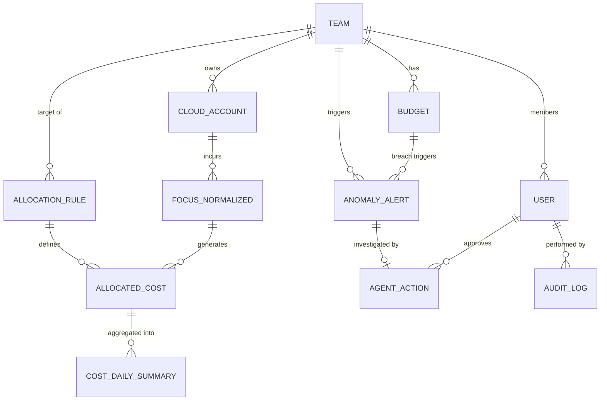

import { Callout, Tabs, Tab } from 'nextra/components'

# Entity Relationship Diagram (ERD)

<Callout type="info" emoji="🗄️">
  The FRT FinOps data model is split across two databases following the hybrid ADR decision: **PostgreSQL** for transactional/operational data (OLTP) and **ClickHouse** for analytical billing data (OLAP). Both are connected by shared keys (`TeamID`, `SubAccountID`).
</Callout>

---

## 1. ERD Overview — Relationships

This view shows only the entities and how they relate, so the relationship structure stays readable. Full attribute lists are in the OLTP / OLAP tabs below.

<Callout type="default" emoji="🔍">
  Hard to read inline? Open the full ERD — dark theme, large font, with toggles for Relationships / OLTP / OLAP.
</Callout>

<a href="/diagrams/erd.en.html" target="_blank" rel="noopener noreferrer" style={{ display: 'inline-flex', alignItems: 'center', gap: '8px', marginTop: '4px', marginBottom: '8px', padding: '10px 18px', background: '#e0a528', color: '#1a1206', fontWeight: 700, fontSize: '14px', borderRadius: '10px', textDecoration: 'none', boxShadow: '0 4px 14px -4px rgba(224,165,40,.5)' }}>⛶ Open full ERD in new tab</a>

> **OLTP (PostgreSQL):** `TEAM`, `CLOUD_ACCOUNT`, `BUDGET`, `ALLOCATION_RULE`, `USER`, `AGENT_ACTION`, `ANOMALY_ALERT`, `AUDIT_LOG` ·
> **OLAP (ClickHouse):** `FOCUS_NORMALIZED`, `ALLOCATED_COST`, `COST_DAILY_SUMMARY`

---

## 1b. Entity Attributes (detailed)

<Tabs items={['OLTP — PostgreSQL', 'OLAP — ClickHouse']}>

<Tab>

### TEAM
| Column | Type | Key | Description |
| :--- | :--- | :--- | :--- |
| team_id | uuid | PK | Unique team identifier |
| team_name | string | | Display name of the team |
| business_unit | string | | Business unit the team rolls up to |
| department | string | | Department / cost-center grouping |
| slack_channel | string | | Channel for budget alerts |
| lead_email | string | | Team lead contact for HITL |
| status | enum | | active \| inactive |
| created_at | timestamp | | Record creation time |

### CLOUD_ACCOUNT
| Column | Type | Key | Description |
| :--- | :--- | :--- | :--- |
| account_id | uuid | PK | Internal account identifier |
| sub_account_id | string | | Provider-native ID (AWS AccountId, Azure SubId...) |
| provider_name | string | | AWS \| Azure \| GCP \| OpenAI \| Anthropic |
| team_id | uuid | FK | Owning team → TEAM |
| environment | string | | dev \| staging \| production |
| account_alias | string | | Human-friendly alias |
| created_at | timestamp | | Record creation time |

### BUDGET
| Column | Type | Key | Description |
| :--- | :--- | :--- | :--- |
| budget_id | uuid | PK | Budget identifier |
| team_id | uuid | FK | Team the budget belongs to → TEAM |
| billing_period | string | | YYYY-MM the budget applies to |
| monthly_limit | decimal | | Approved monthly spend cap |
| alert_80_sent | timestamp | | When the 80% alert fired (null = not yet) |
| alert_90_sent | timestamp | | When the 90% alert fired |
| alert_100_sent | timestamp | | When the 100% alert fired |
| created_at | timestamp | | Creation time |
| updated_at | timestamp | | Last update time |

### ALLOCATION_RULE
| Column | Type | Key | Description |
| :--- | :--- | :--- | :--- |
| rule_id | uuid | PK | Rule identifier |
| rule_type | string | | tag-based \| account-based \| shared-cost |
| priority | int | | Lower number = higher priority (evaluated first) |
| match_criteria | jsonb | | `{tag_key,tag_value}` / `{sub_account_id}` / `{shared_metric}` |
| target_team_id | uuid | FK | Team the cost is attributed to → TEAM |
| split_method | string | | proportional \| fixed \| equal |
| is_active | boolean | | Whether the rule is currently applied |
| created_by | uuid | | User who created the rule |
| created_at | timestamp | | Creation time |
| updated_at | timestamp | | Last update time |

### USER
| Column | Type | Key | Description |
| :--- | :--- | :--- | :--- |
| user_id | uuid | PK | User identifier |
| email | string | | Login email |
| name | string | | Full name |
| role | enum | | finops_admin \| engineer \| finance \| executive |
| team_id | uuid | FK | Team membership → TEAM (nullable for execs) |
| sso_subject | string | | Okta / Entra ID subject for SSO |
| last_login | timestamp | | Most recent login |

### AGENT_ACTION
| Column | Type | Key | Description |
| :--- | :--- | :--- | :--- |
| action_id | uuid | PK | Action identifier |
| action_type | string | | rate-limit \| tag-fix \| alert-suppress \| recommendation |
| status | string | | pending_hitl \| approved \| rejected \| executed \| failed |
| triggered_by_alert | uuid | FK | Source alert → ANOMALY_ALERT |
| proposed_action | jsonb | | Structured remediation payload (replayable) |
| confidence_score | decimal | | Agent confidence; below threshold ⇒ HITL |
| approved_by | uuid | FK | Approving user → USER (nullable) |
| rejection_reason | string | | Why it was rejected (nullable) |
| created_at | timestamp | | When the action was proposed |
| resolved_at | timestamp | | When approved / rejected / executed |

### ANOMALY_ALERT
| Column | Type | Key | Description |
| :--- | :--- | :--- | :--- |
| alert_id | uuid | PK | Alert identifier |
| team_id | uuid | FK | Team the spike belongs to → TEAM |
| billing_period | string | | Period the anomaly was detected in |
| baseline_cost | decimal | | Expected cost (rolling baseline) |
| actual_cost | decimal | | Observed cost that triggered the alert |
| z_score | decimal | | Statistical deviation from baseline |
| top_driver_service | string | | Service category driving the spike |
| top_driver_resource | string | | Specific resource driving the spike |
| status | string | | open \| investigating \| resolved \| false_positive |
| detected_at | timestamp | | When detected |
| resolved_at | timestamp | | When resolved |

### AUDIT_LOG
| Column | Type | Key | Description |
| :--- | :--- | :--- | :--- |
| log_id | uuid | PK | Log entry identifier |
| entity_type | string | | allocation_rule \| budget \| agent_action \| user |
| entity_id | uuid | | ID of the changed entity |
| action | string | | create \| update \| delete \| approve \| reject \| execute |
| performed_by | uuid | FK | Actor → USER |
| before_state | jsonb | | Snapshot before change |
| after_state | jsonb | | Snapshot after change |
| created_at | timestamp | | When logged (append-only) |

</Tab>

<Tab>

### FOCUS_NORMALIZED
| Column | Type | Description |
| :--- | :--- | :--- |
| billing_period | string | YYYY-MM-DD · partition key |
| provider_name | string | FOCUS: ProviderName |
| sub_account_id | string | FOCUS: SubAccountId · links to CLOUD_ACCOUNT |
| service_category | string | FOCUS: ServiceCategory |
| service_name | string | FOCUS: ServiceName |
| resource_id | string | FOCUS: ResourceId |
| resource_name | string | FOCUS: ResourceName |
| charge_category | string | Usage \| Tax \| Credit |
| billed_cost | decimal | FOCUS: BilledCost (exact decimal) |
| effective_cost | decimal | FOCUS: EffectiveCost (post-discount) |
| billing_currency | string | FOCUS: BillingCurrency (per-currency zero-sum) |
| tags | map | FOCUS: Tags `{CostCenter, Owner, Env}` |
| region | string | FOCUS: Region |
| s3_source_path | string | Traceability back to the raw file |
| ingested_at | timestamp | Ingestion version key (append-only) |

### ALLOCATED_COST
| Column | Type | Description |
| :--- | :--- | :--- |
| billing_period | string | Partition key |
| sub_account_id | string | Source sub-account |
| provider_name | string | Source provider |
| service_category | string | Carried from the FOCUS record |
| service_name | string | Carried from the FOCUS record |
| resource_id | string | Carried from the FOCUS record |
| billed_cost | decimal | Allocated portion of BilledCost |
| effective_cost | decimal | Allocated portion of EffectiveCost |
| billing_currency | string | Currency of the allocated amount |
| team_id | uuid | Resolved team (may be \_\_UNALLOCATED\_\_) |
| business_unit | string | Stamped from the team |
| environment | string | dev \| staging \| production |
| allocation_rule_id | uuid | Which rule allocated this row → ALLOCATION_RULE |
| split_method | string | How the cost was split |
| split_ratio | decimal | Fraction for shared-cost rows (largest-remainder) |
| allocated_at | timestamp | Allocation_Run version timestamp |

### COST_DAILY_SUMMARY
| Column | Type | Description |
| :--- | :--- | :--- |
| summary_date | string | Partition key (daily rollup) |
| team_id | uuid | Team the rollup belongs to |
| provider_name | string | Provider dimension |
| service_category | string | Service dimension |
| environment | string | Environment dimension |
| total_billed_cost | decimal | Sum of billed_cost for the group |
| total_effective_cost | decimal | Sum of effective_cost for the group |
| record_count | int | Rows aggregated into this summary |
| computed_at | timestamp | When the rollup was materialized |

</Tab>

</Tabs>

---

## 2. Database Mapping

<Tabs items={['PostgreSQL (OLTP)', 'ClickHouse (OLAP)']}>

<Tab>
### PostgreSQL — Transactional / Operational Tables

These tables store configuration, rules, and state that require ACID transactions and frequent updates.

| Table | Purpose | Key Relationships |
| :--- | :--- | :--- |
| `TEAM` | Master list of Engineering/Product teams | Parent of `CLOUD_ACCOUNT`, `BUDGET`, `USER` |
| `CLOUD_ACCOUNT` | Maps cloud sub-accounts to teams | Links `SubAccountId` (provider) → `TeamID` |
| `BUDGET` | Monthly budget limits + alert flags | Belongs to `TEAM`; alert state tracked per threshold |
| `ALLOCATION_RULE` | Ordered rules for cost attribution | Points to target `TEAM`; priority determines execution order |
| `USER` | Platform users with roles (RBAC) | Belongs to `TEAM`; linked to SSO (Okta/Entra) |
| `ANOMALY_ALERT` | Records detected cost anomalies | Belongs to `TEAM`; triggers `AGENT_ACTION` |
| `AGENT_ACTION` | HITL workflow state for remediation | Links to `ANOMALY_ALERT` and approving `USER` |
| `AUDIT_LOG` | Immutable event log of all changes | References any entity; performed by `USER` |

**Key design decisions:**
- `ALLOCATION_RULE.priority` (int) controls execution order — lower number = higher priority. Tag-based rules always run before account-based.
- `BUDGET` alert flags (`alert_80_sent`, `alert_90_sent`, `alert_100_sent`) are timestamps, not booleans. This allows re-alerting in a new billing period while preventing duplicate alerts within the same period.
- `AUDIT_LOG` is append-only — no UPDATE or DELETE is permitted via the application layer.
- `AGENT_ACTION.proposed_action` (JSONB) stores the full structured payload so the exact remediation action can be replayed or reviewed at any time.

</Tab>

<Tab>
### ClickHouse — Analytical Tables (OLAP)

These tables store high-volume billing records and are optimized for aggregation queries. All schemas are aligned to the **FOCUS 1.4** standard.

| Table | Purpose | Partition Key | Engine |
| :--- | :--- | :--- | :--- |
| `FOCUS_NORMALIZED` | Raw FOCUS-standard billing records after ETL | `billing_period` (monthly) | `MergeTree` |
| `ALLOCATED_COST` | Cost records enriched with `TeamID` after allocation | `billing_period` | `MergeTree` |
| `COST_DAILY_SUMMARY` | Pre-aggregated daily rollup per team/service | `summary_date` | `SummingMergeTree` |

**Key design decisions:**
- `FOCUS_NORMALIZED` is **append-only** — raw billing records are never updated. Re-ingestion creates new rows; duplicate handling uses `ReplacingMergeTree` with `ingested_at` as the version key.
- `ALLOCATED_COST` stores `split_ratio` for shared-cost rows, enabling full auditability of proportional distributions.
- `COST_DAILY_SUMMARY` is a materialized view / scheduled aggregation to serve Dashboard queries at sub-second latency, avoiding full scans on `ALLOCATED_COST` for every chart render.
- Cross-database joins (PostgreSQL ↔ ClickHouse) are handled at the **application layer** (NestJS), not via DB-level federation, to avoid tight coupling.

</Tab>

</Tabs>

---

## 3. FOCUS Column Mapping Reference

The `FOCUS_NORMALIZED` table is the canonical source of truth. Below is the mapping from vendor-specific columns to FOCUS 1.4 standard:

| FOCUS Column | AWS CUR | Azure Export | GCP Billing | OpenAI Usage |
| :--- | :--- | :--- | :--- | :--- |
| `BilledCost` | `UnblendedCost` | `Cost` | `Cost after credits` | `total_usage.cost` |
| `EffectiveCost` | `EffectiveCost` | `CostInBillingCurrency` | `Cost` | — |
| `ProviderName` | `"AWS"` | `"Azure"` | `"GCP"` | `"OpenAI"` |
| `SubAccountId` | `linkedAccountId` | `subscriptionId` | `project.id` | `organization_id` |
| `ServiceCategory` | `productFamily` | `meterCategory` | `service.description` | `"AI API"` |
| `ServiceName` | `productName` | `meterName` | `sku.description` | `model` |
| `ResourceId` | `resourceId` | `resourceId` | `resource.name` | — |
| `ChargeCategory` | `lineItemType` | `ChargeType` | `type` | `"Usage"` |
| `BillingCurrency` | `currencyCode` | `billingCurrency` | `currency` | `currency` |
| `Tags` | `resourceTags` | `tags` | `labels` | — |

---

## 4. Data Retention Policy

| Table | Retention | Rationale |
| :--- | :--- | :--- |
| `FOCUS_NORMALIZED` | 3 years | Compliance & trend analysis |
| `ALLOCATED_COST` | 3 years | Chargeback audit trail |
| `COST_DAILY_SUMMARY` | 2 years | Dashboard performance |
| `AUDIT_LOG` | 5 years | SOC2 compliance requirement |
| `AGENT_ACTION` | 2 years | Agent behavior review |
| `ANOMALY_ALERT` | 1 year | Incident history |
