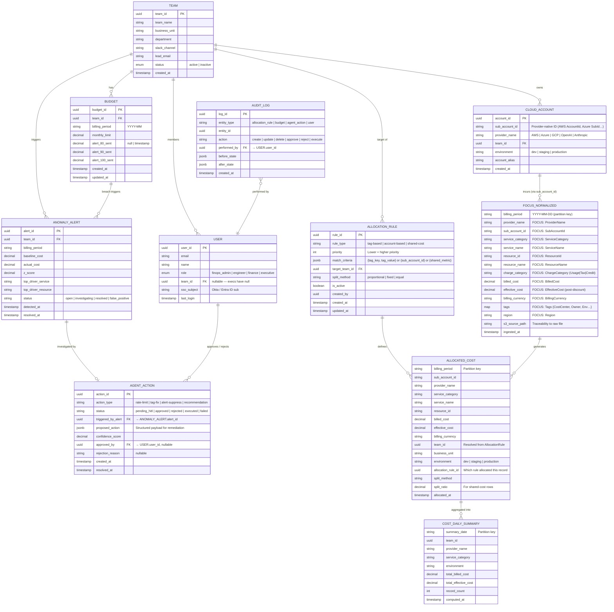

import { Callout, Tabs, Tab } from 'nextra/components'

# Entity Relationship Diagram (ERD)

<Callout type="info" emoji="🗄️">
  The FRT FinOps data model is split across two databases following the hybrid ADR decision: **PostgreSQL** for transactional/operational data (OLTP) and **ClickHouse** for analytical billing data (OLAP). Both are connected by shared keys (`TeamID`, `SubAccountID`).
</Callout>

---

## 1. Full ERD Overview

---

## 2. Database Mapping

<Tabs items={['PostgreSQL (OLTP)', 'ClickHouse (OLAP)']}>

<Tab>
### PostgreSQL — Transactional / Operational Tables

These tables store configuration, rules, and state that require ACID transactions and frequent updates.

| Table | Purpose | Key Relationships |
| :--- | :--- | :--- |
| `TEAM` | Master list of Engineering/Product teams | Parent of `CLOUD_ACCOUNT`, `BUDGET`, `USER` |
| `CLOUD_ACCOUNT` | Maps cloud sub-accounts to teams | Links `SubAccountId` (provider) → `TeamID` |
| `BUDGET` | Monthly budget limits + alert flags | Belongs to `TEAM`; alert state tracked per threshold |
| `ALLOCATION_RULE` | Ordered rules for cost attribution | Points to target `TEAM`; priority determines execution order |
| `USER` | Platform users with roles (RBAC) | Belongs to `TEAM`; linked to SSO (Okta/Entra) |
| `ANOMALY_ALERT` | Records detected cost anomalies | Belongs to `TEAM`; triggers `AGENT_ACTION` |
| `AGENT_ACTION` | HITL workflow state for remediation | Links to `ANOMALY_ALERT` and approving `USER` |
| `AUDIT_LOG` | Immutable event log of all changes | References any entity; performed by `USER` |

**Key design decisions:**
- `ALLOCATION_RULE.priority` (int) controls execution order — lower number = higher priority. Tag-based rules always run before account-based.
- `BUDGET` alert flags (`alert_80_sent`, `alert_90_sent`, `alert_100_sent`) are timestamps, not booleans. This allows re-alerting in a new billing period while preventing duplicate alerts within the same period.
- `AUDIT_LOG` is append-only — no UPDATE or DELETE is permitted via the application layer.
- `AGENT_ACTION.proposed_action` (JSONB) stores the full structured payload so the exact remediation action can be replayed or reviewed at any time.

</Tab>

<Tab>
### ClickHouse — Analytical Tables (OLAP)

These tables store high-volume billing records and are optimized for aggregation queries. All schemas are aligned to the **FOCUS 1.4** standard.

| Table | Purpose | Partition Key | Engine |
| :--- | :--- | :--- | :--- |
| `FOCUS_NORMALIZED` | Raw FOCUS-standard billing records after ETL | `billing_period` (monthly) | `MergeTree` |
| `ALLOCATED_COST` | Cost records enriched with `TeamID` after allocation | `billing_period` | `MergeTree` |
| `COST_DAILY_SUMMARY` | Pre-aggregated daily rollup per team/service | `summary_date` | `SummingMergeTree` |

**Key design decisions:**
- `FOCUS_NORMALIZED` is **append-only** — raw billing records are never updated. Re-ingestion creates new rows; duplicate handling uses `ReplacingMergeTree` with `ingested_at` as the version key.
- `ALLOCATED_COST` stores `split_ratio` for shared-cost rows, enabling full auditability of proportional distributions.
- `COST_DAILY_SUMMARY` is a materialized view / scheduled aggregation to serve Dashboard queries at sub-second latency, avoiding full scans on `ALLOCATED_COST` for every chart render.
- Cross-database joins (PostgreSQL ↔ ClickHouse) are handled at the **application layer** (NestJS), not via DB-level federation, to avoid tight coupling.

</Tab>

</Tabs>

---

## 3. FOCUS Column Mapping Reference

The `FOCUS_NORMALIZED` table is the canonical source of truth. Below is the mapping from vendor-specific columns to FOCUS 1.4 standard:

| FOCUS Column | AWS CUR | Azure Export | GCP Billing | OpenAI Usage |
| :--- | :--- | :--- | :--- | :--- |
| `BilledCost` | `UnblendedCost` | `Cost` | `Cost after credits` | `total_usage.cost` |
| `EffectiveCost` | `EffectiveCost` | `CostInBillingCurrency` | `Cost` | — |
| `ProviderName` | `"AWS"` | `"Azure"` | `"GCP"` | `"OpenAI"` |
| `SubAccountId` | `linkedAccountId` | `subscriptionId` | `project.id` | `organization_id` |
| `ServiceCategory` | `productFamily` | `meterCategory` | `service.description` | `"AI API"` |
| `ServiceName` | `productName` | `meterName` | `sku.description` | `model` |
| `ResourceId` | `resourceId` | `resourceId` | `resource.name` | — |
| `ChargeCategory` | `lineItemType` | `ChargeType` | `type` | `"Usage"` |
| `BillingCurrency` | `currencyCode` | `billingCurrency` | `currency` | `currency` |
| `Tags` | `resourceTags` | `tags` | `labels` | — |

---

## 4. Data Retention Policy

| Table | Retention | Rationale |
| :--- | :--- | :--- |
| `FOCUS_NORMALIZED` | 3 years | Compliance & trend analysis |
| `ALLOCATED_COST` | 3 years | Chargeback audit trail |
| `COST_DAILY_SUMMARY` | 2 years | Dashboard performance |
| `AUDIT_LOG` | 5 years | SOC2 compliance requirement |
| `AGENT_ACTION` | 2 years | Agent behavior review |
| `ANOMALY_ALERT` | 1 year | Incident history |
