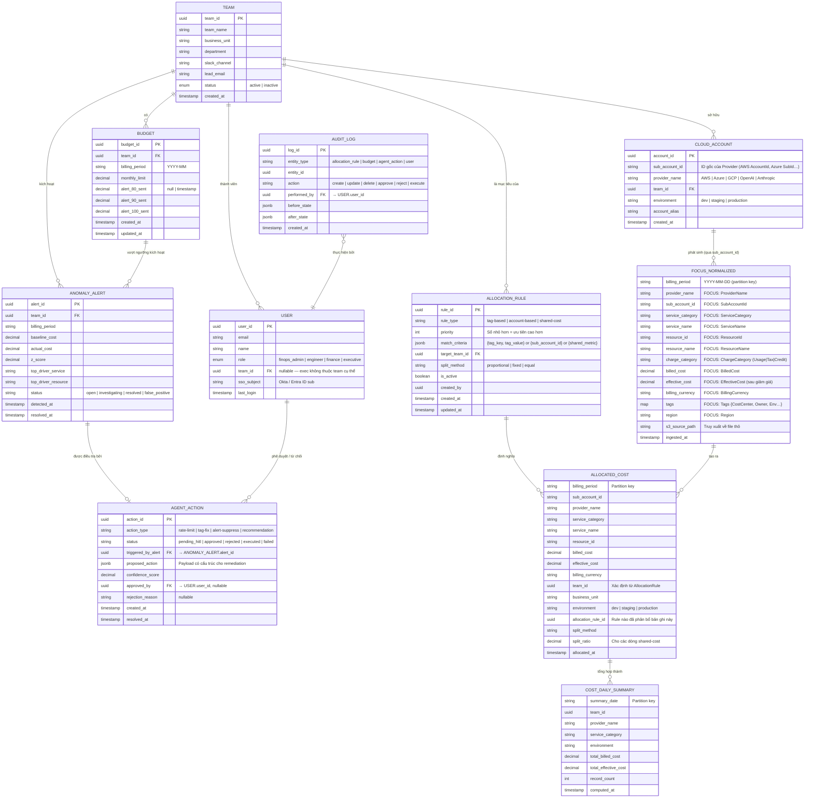

import { Callout, Tabs, Tab } from 'nextra/components'

# Sơ đồ Quan hệ Thực thể (ERD)

<Callout type="info" emoji="🗄️">
  Data model của FRT FinOps được phân chia trên hai database theo quyết định ADR hybrid: **PostgreSQL** cho dữ liệu giao dịch/vận hành (OLTP) và **ClickHouse** cho dữ liệu billing phân tích (OLAP). Cả hai kết nối với nhau qua các shared key (`TeamID`, `SubAccountID`).
</Callout>

---

## 1. ERD Tổng quan

---

## 2. Phân bổ Database

<Tabs items={['PostgreSQL (OLTP)', 'ClickHouse (OLAP)']}>

<Tab>
### PostgreSQL — Bảng Giao dịch / Vận hành

Các bảng này lưu cấu hình, rules và trạng thái cần ACID transactions và cập nhật thường xuyên.

| Bảng | Mục đích | Quan hệ chính |
| :--- | :--- | :--- |
| `TEAM` | Danh sách master các team Engineering/Product | Cha của `CLOUD_ACCOUNT`, `BUDGET`, `USER` |
| `CLOUD_ACCOUNT` | Map cloud sub-accounts → teams | Kết nối `SubAccountId` (provider) → `TeamID` |
| `BUDGET` | Giới hạn ngân sách tháng + cờ cảnh báo | Thuộc về `TEAM`; trạng thái cảnh báo tracked per threshold |
| `ALLOCATION_RULE` | Rules có thứ tự để phân bổ chi phí | Trỏ đến target `TEAM`; priority xác định thứ tự thực thi |
| `USER` | Người dùng platform với roles (RBAC) | Thuộc về `TEAM`; liên kết với SSO (Okta/Entra) |
| `ANOMALY_ALERT` | Ghi nhận các bất thường chi phí phát hiện | Thuộc về `TEAM`; kích hoạt `AGENT_ACTION` |
| `AGENT_ACTION` | Trạng thái HITL workflow cho remediation | Liên kết với `ANOMALY_ALERT` và `USER` phê duyệt |
| `AUDIT_LOG` | Event log bất biến của mọi thay đổi | Tham chiếu bất kỳ entity; thực hiện bởi `USER` |

**Các quyết định thiết kế chính:**
- `ALLOCATION_RULE.priority` (int) kiểm soát thứ tự thực thi — số nhỏ hơn = ưu tiên cao hơn. Tag-based rules luôn chạy trước account-based.
- Các cờ cảnh báo trong `BUDGET` (`alert_80_sent`, `alert_90_sent`, `alert_100_sent`) là timestamps, không phải booleans. Điều này cho phép cảnh báo lại trong billing period mới trong khi ngăn duplicate alerts trong cùng một period.
- `AUDIT_LOG` là append-only — không có UPDATE hay DELETE nào được phép ở tầng application.
- `AGENT_ACTION.proposed_action` (JSONB) lưu toàn bộ structured payload để hành động remediation chính xác có thể được replay hoặc review bất kỳ lúc nào.

</Tab>

<Tab>
### ClickHouse — Bảng Phân tích (OLAP)

Các bảng này lưu billing records khối lượng lớn và được tối ưu cho aggregation queries. Tất cả schema được căn chỉnh theo chuẩn **FOCUS 1.4**.

| Bảng | Mục đích | Partition Key | Engine |
| :--- | :--- | :--- | :--- |
| `FOCUS_NORMALIZED` | Billing records theo chuẩn FOCUS sau ETL | `billing_period` (monthly) | `MergeTree` |
| `ALLOCATED_COST` | Billing records được enriched với `TeamID` sau phân bổ | `billing_period` | `MergeTree` |
| `COST_DAILY_SUMMARY` | Rollup hàng ngày đã pre-aggregated per team/service | `summary_date` | `SummingMergeTree` |

**Các quyết định thiết kế chính:**
- `FOCUS_NORMALIZED` là **append-only** — billing records thô không bao giờ được cập nhật. Re-ingestion tạo rows mới; xử lý duplicate dùng `ReplacingMergeTree` với `ingested_at` là version key.
- `ALLOCATED_COST` lưu `split_ratio` cho các shared-cost rows, cho phép audit đầy đủ về phân phối tỷ lệ.
- `COST_DAILY_SUMMARY` là materialized view / scheduled aggregation để phục vụ Dashboard queries với độ trễ dưới giây, tránh full scan trên `ALLOCATED_COST` cho mỗi lần render chart.
- Các cross-database joins (PostgreSQL ↔ ClickHouse) được xử lý ở **application layer** (NestJS), không phải DB-level federation, để tránh tight coupling.

</Tab>

</Tabs>

---

## 3. Bảng Mapping FOCUS Columns

Bảng `FOCUS_NORMALIZED` là canonical source of truth. Dưới đây là mapping từ cột vendor-specific sang chuẩn FOCUS 1.4:

| FOCUS Column | AWS CUR | Azure Export | GCP Billing | OpenAI Usage |
| :--- | :--- | :--- | :--- | :--- |
| `BilledCost` | `UnblendedCost` | `Cost` | `Cost after credits` | `total_usage.cost` |
| `EffectiveCost` | `EffectiveCost` | `CostInBillingCurrency` | `Cost` | — |
| `ProviderName` | `"AWS"` | `"Azure"` | `"GCP"` | `"OpenAI"` |
| `SubAccountId` | `linkedAccountId` | `subscriptionId` | `project.id` | `organization_id` |
| `ServiceCategory` | `productFamily` | `meterCategory` | `service.description` | `"AI API"` |
| `ServiceName` | `productName` | `meterName` | `sku.description` | `model` |
| `ResourceId` | `resourceId` | `resourceId` | `resource.name` | — |
| `ChargeCategory` | `lineItemType` | `ChargeType` | `type` | `"Usage"` |
| `BillingCurrency` | `currencyCode` | `billingCurrency` | `currency` | `currency` |
| `Tags` | `resourceTags` | `tags` | `labels` | — |

---

## 4. Chính sách Lưu giữ Dữ liệu

| Bảng | Thời gian lưu | Lý do |
| :--- | :--- | :--- |
| `FOCUS_NORMALIZED` | 3 năm | Compliance & phân tích xu hướng |
| `ALLOCATED_COST` | 3 năm | Audit trail chargeback |
| `COST_DAILY_SUMMARY` | 2 năm | Hiệu suất Dashboard |
| `AUDIT_LOG` | 5 năm | Yêu cầu tuân thủ SOC2 |
| `AGENT_ACTION` | 2 năm | Review hành vi Agent |
| `ANOMALY_ALERT` | 1 năm | Lịch sử sự cố |
