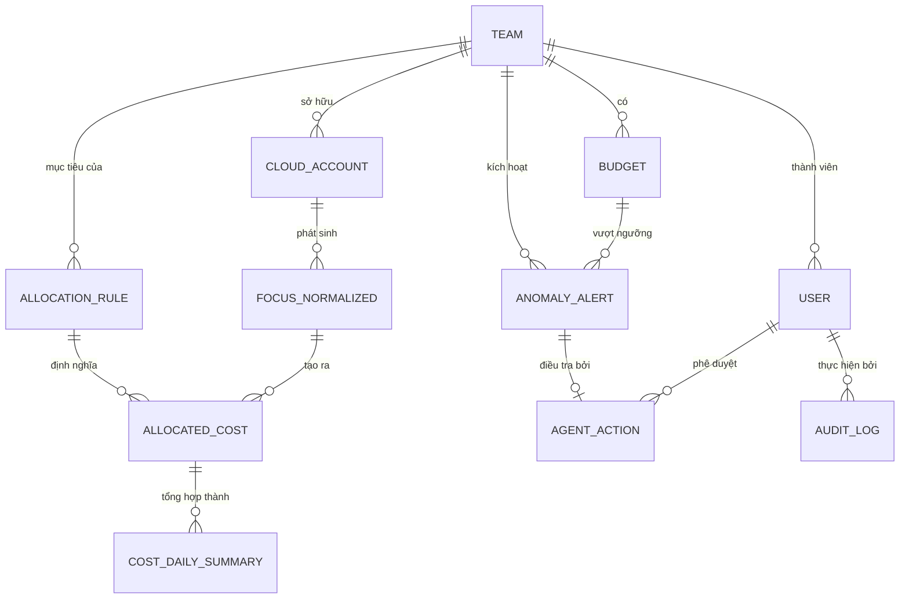

import { Callout, Tabs, Tab } from 'nextra/components'

# Sơ đồ Quan hệ Thực thể (ERD)

<Callout type="info" emoji="🗄️">
  Data model của FRT FinOps được phân chia trên hai database theo quyết định ADR hybrid: **PostgreSQL** cho dữ liệu giao dịch/vận hành (OLTP) và **ClickHouse** cho dữ liệu billing phân tích (OLAP). Cả hai kết nối với nhau qua các shared key (`TeamID`, `SubAccountID`).
</Callout>

---

## 1. ERD Tổng quan — Quan hệ

View này chỉ hiển thị các entity và cách chúng liên kết, để cấu trúc quan hệ dễ đọc. Danh sách attribute đầy đủ nằm ở các tab OLTP / OLAP bên dưới.

<Callout type="default" emoji="🔍">
  Khó đọc trong trang? Mở ERD đầy đủ — nền tối, font lớn, có nút chuyển Quan hệ / OLTP / OLAP.
</Callout>

<a href="/diagrams/erd.vi.html" target="_blank" rel="noopener noreferrer" style={{ display: 'inline-flex', alignItems: 'center', gap: '8px', marginTop: '4px', marginBottom: '8px', padding: '10px 18px', background: '#e0a528', color: '#1a1206', fontWeight: 700, fontSize: '14px', borderRadius: '10px', textDecoration: 'none', boxShadow: '0 4px 14px -4px rgba(224,165,40,.5)' }}>⛶ Mở ERD tổng thể ở tab mới</a>

> **OLTP (PostgreSQL):** `TEAM`, `CLOUD_ACCOUNT`, `BUDGET`, `ALLOCATION_RULE`, `USER`, `AGENT_ACTION`, `ANOMALY_ALERT`, `AUDIT_LOG` ·
> **OLAP (ClickHouse):** `FOCUS_NORMALIZED`, `ALLOCATED_COST`, `COST_DAILY_SUMMARY`

---

## 1b. Chi tiết Attribute từng Entity

<Tabs items={['OLTP — PostgreSQL', 'OLAP — ClickHouse']}>

<Tab>

### TEAM
| Cột | Kiểu | Khóa | Mô tả |
| :--- | :--- | :--- | :--- |
| team_id | uuid | PK | Định danh team duy nhất |
| team_name | string | | Tên hiển thị của team |
| business_unit | string | | Business unit mà team thuộc về |
| department | string | | Phòng ban / cost center |
| slack_channel | string | | Channel nhận budget alert |
| lead_email | string | | Liên hệ team lead cho HITL |
| status | enum | | active \| inactive |
| created_at | timestamp | | Thời điểm tạo |

### CLOUD_ACCOUNT
| Cột | Kiểu | Khóa | Mô tả |
| :--- | :--- | :--- | :--- |
| account_id | uuid | PK | Định danh account nội bộ |
| sub_account_id | string | | ID gốc của provider (AWS AccountId, Azure SubId...) |
| provider_name | string | | AWS \| Azure \| GCP \| OpenAI \| Anthropic |
| team_id | uuid | FK | Team sở hữu → TEAM |
| environment | string | | dev \| staging \| production |
| account_alias | string | | Alias dễ đọc |
| created_at | timestamp | | Thời điểm tạo |

### BUDGET
| Cột | Kiểu | Khóa | Mô tả |
| :--- | :--- | :--- | :--- |
| budget_id | uuid | PK | Định danh budget |
| team_id | uuid | FK | Team sở hữu budget → TEAM |
| billing_period | string | | YYYY-MM mà budget áp dụng |
| monthly_limit | decimal | | Hạn mức chi tiêu tháng đã duyệt |
| alert_80_sent | timestamp | | Lúc bắn alert 80% (null = chưa) |
| alert_90_sent | timestamp | | Lúc bắn alert 90% |
| alert_100_sent | timestamp | | Lúc bắn alert 100% |
| created_at | timestamp | | Thời điểm tạo |
| updated_at | timestamp | | Lần cập nhật cuối |

### ALLOCATION_RULE
| Cột | Kiểu | Khóa | Mô tả |
| :--- | :--- | :--- | :--- |
| rule_id | uuid | PK | Định danh rule |
| rule_type | string | | tag-based \| account-based \| shared-cost |
| priority | int | | Số nhỏ = ưu tiên cao (xét trước) |
| match_criteria | jsonb | | `{tag_key,tag_value}` / `{sub_account_id}` / `{shared_metric}` |
| target_team_id | uuid | FK | Team được gán cost → TEAM |
| split_method | string | | proportional \| fixed \| equal |
| is_active | boolean | | Rule có đang áp dụng không |
| created_by | uuid | | User tạo rule |
| created_at | timestamp | | Thời điểm tạo |
| updated_at | timestamp | | Lần cập nhật cuối |

### USER
| Cột | Kiểu | Khóa | Mô tả |
| :--- | :--- | :--- | :--- |
| user_id | uuid | PK | Định danh user |
| email | string | | Email đăng nhập |
| name | string | | Họ tên |
| role | enum | | finops_admin \| engineer \| finance \| executive |
| team_id | uuid | FK | Thuộc team → TEAM (nullable cho exec) |
| sso_subject | string | | Subject Okta / Entra ID cho SSO |
| last_login | timestamp | | Lần đăng nhập gần nhất |

### AGENT_ACTION
| Cột | Kiểu | Khóa | Mô tả |
| :--- | :--- | :--- | :--- |
| action_id | uuid | PK | Định danh action |
| action_type | string | | rate-limit \| tag-fix \| alert-suppress \| recommendation |
| status | string | | pending_hitl \| approved \| rejected \| executed \| failed |
| triggered_by_alert | uuid | FK | Alert nguồn → ANOMALY_ALERT |
| proposed_action | jsonb | | Payload remediation có cấu trúc (replay được) |
| confidence_score | decimal | | Độ tin cậy agent; dưới ngưỡng ⇒ HITL |
| approved_by | uuid | FK | User phê duyệt → USER (nullable) |
| rejection_reason | string | | Lý do từ chối (nullable) |
| created_at | timestamp | | Lúc đề xuất action |
| resolved_at | timestamp | | Lúc duyệt / từ chối / thực thi |

### ANOMALY_ALERT
| Cột | Kiểu | Khóa | Mô tả |
| :--- | :--- | :--- | :--- |
| alert_id | uuid | PK | Định danh alert |
| team_id | uuid | FK | Team có spike → TEAM |
| billing_period | string | | Kỳ phát hiện bất thường |
| baseline_cost | decimal | | Cost kỳ vọng (baseline trượt) |
| actual_cost | decimal | | Cost thực tế kích hoạt alert |
| z_score | decimal | | Độ lệch thống kê so với baseline |
| top_driver_service | string | | Service category gây spike |
| top_driver_resource | string | | Resource cụ thể gây spike |
| status | string | | open \| investigating \| resolved \| false_positive |
| detected_at | timestamp | | Lúc phát hiện |
| resolved_at | timestamp | | Lúc xử lý xong |

### AUDIT_LOG
| Cột | Kiểu | Khóa | Mô tả |
| :--- | :--- | :--- | :--- |
| log_id | uuid | PK | Định danh log entry |
| entity_type | string | | allocation_rule \| budget \| agent_action \| user |
| entity_id | uuid | | ID của entity bị thay đổi |
| action | string | | create \| update \| delete \| approve \| reject \| execute |
| performed_by | uuid | FK | Người thực hiện → USER |
| before_state | jsonb | | Snapshot trước thay đổi |
| after_state | jsonb | | Snapshot sau thay đổi |
| created_at | timestamp | | Lúc ghi log (append-only) |

</Tab>

<Tab>

### FOCUS_NORMALIZED
| Cột | Kiểu | Mô tả |
| :--- | :--- | :--- |
| billing_period | string | YYYY-MM · partition key, suy ra từ BillingPeriodStart |
| charge_period_start | timestamp | FOCUS: ChargePeriodStart (granularity mức charge) |
| charge_period_end | timestamp | FOCUS: ChargePeriodEnd |
| billing_period_start | timestamp | FOCUS: BillingPeriodStart |
| billing_period_end | timestamp | FOCUS: BillingPeriodEnd |
| provider_name | string | FOCUS: ProviderName |
| sub_account_id | string | FOCUS: SubAccountId · liên kết CLOUD_ACCOUNT |
| service_category | string | FOCUS: ServiceCategory (service domain chuẩn hóa) |
| service_subcategory | string | FOCUS: ServiceSubcategory (group gốc FPT/provider) |
| service_name | string | FOCUS: ServiceName |
| resource_id | string | FOCUS: ResourceId |
| resource_name | string | FOCUS: ResourceName |
| charge_category | string | FOCUS: ChargeCategory · Usage \| Tax \| Credit |
| billed_cost | decimal | FOCUS: BilledCost (decimal chính xác) |
| effective_cost | decimal | FOCUS: EffectiveCost (sau giảm giá) |
| billing_currency | string | FOCUS: BillingCurrency (zero-sum theo tiền tệ) |
| consumed_quantity | decimal | FOCUS: ConsumedQuantity |
| consumed_unit | string | FOCUS: ConsumedUnit |
| pricing_unit | string | FOCUS: PricingUnit |
| tags | map | FOCUS: Tags `{CostCenter, Owner, Env}` |
| region_id | string | FOCUS: RegionId |
| region_name | string | FOCUS: RegionName |
| s3_source_path | string | Truy vết về file raw |
| ingested_at | timestamp | Ingestion version key (append-only) |

### ALLOCATED_COST
| Cột | Kiểu | Mô tả |
| :--- | :--- | :--- |
| billing_period | string | Partition key |
| sub_account_id | string | Sub-account nguồn |
| provider_name | string | Provider nguồn |
| service_category | string | Mang theo từ FOCUS record |
| service_subcategory | string | Mang theo từ FOCUS record |
| service_name | string | Mang theo từ FOCUS record |
| resource_id | string | Mang theo từ FOCUS record |
| billed_cost | decimal | Phần BilledCost đã phân bổ |
| effective_cost | decimal | Phần EffectiveCost đã phân bổ |
| billing_currency | string | Tiền tệ của khoản đã phân bổ |
| team_id | uuid | Team được resolve (có thể là \_\_UNALLOCATED\_\_) |
| business_unit | string | Gán từ team |
| environment | string | dev \| staging \| production |
| allocated_method_id | string | FOCUS: AllocatedMethodId · rule id / rule type đã áp dụng |
| allocated_method_details | string | FOCUS: AllocatedMethodDetails · chi tiết cách chia (internal split_ratio map vào đây, largest-remainder) |
| allocated_resource_id | string | FOCUS: AllocatedResourceId · resource được phân bổ cost từ đó |
| allocated_tags | map | FOCUS: AllocatedTags · tags điều khiển việc phân bổ |
| allocated_at | timestamp | Timestamp của Allocation_Run |

### COST_DAILY_SUMMARY
| Cột | Kiểu | Mô tả |
| :--- | :--- | :--- |
| summary_date | string | Partition key (rollup ngày) |
| team_id | uuid | Team của rollup |
| provider_name | string | Chiều provider |
| service_category | string | Chiều service |
| environment | string | Chiều environment |
| total_billed_cost | decimal | Tổng billed_cost của nhóm |
| total_effective_cost | decimal | Tổng effective_cost của nhóm |
| record_count | int | Số dòng gom vào summary này |
| computed_at | timestamp | Lúc materialize rollup |

</Tab>

</Tabs>

---

## 2. Phân bổ Database

<Tabs items={['PostgreSQL (OLTP)', 'ClickHouse (OLAP)']}>

<Tab>
### PostgreSQL — Bảng Giao dịch / Vận hành

Các bảng này lưu cấu hình, rules và trạng thái cần ACID transactions và cập nhật thường xuyên.

| Bảng | Mục đích | Quan hệ chính |
| :--- | :--- | :--- |
| `TEAM` | Danh sách master các team Engineering/Product | Cha của `CLOUD_ACCOUNT`, `BUDGET`, `USER` |
| `CLOUD_ACCOUNT` | Map cloud sub-accounts → teams | Kết nối `SubAccountId` (provider) → `TeamID` |
| `BUDGET` | Giới hạn ngân sách tháng + cờ cảnh báo | Thuộc về `TEAM`; trạng thái cảnh báo tracked per threshold |
| `ALLOCATION_RULE` | Rules có thứ tự để phân bổ chi phí | Trỏ đến target `TEAM`; priority xác định thứ tự thực thi |
| `USER` | Người dùng platform với roles (RBAC) | Thuộc về `TEAM`; liên kết với SSO (Okta/Entra) |
| `ANOMALY_ALERT` | Ghi nhận các bất thường chi phí phát hiện | Thuộc về `TEAM`; kích hoạt `AGENT_ACTION` |
| `AGENT_ACTION` | Trạng thái HITL workflow cho remediation | Liên kết với `ANOMALY_ALERT` và `USER` phê duyệt |
| `AUDIT_LOG` | Event log bất biến của mọi thay đổi | Tham chiếu bất kỳ entity; thực hiện bởi `USER` |

**Các quyết định thiết kế chính:**
- `ALLOCATION_RULE.priority` (int) kiểm soát thứ tự thực thi — số nhỏ hơn = ưu tiên cao hơn. Tag-based rules luôn chạy trước account-based.
- Các cờ cảnh báo trong `BUDGET` (`alert_80_sent`, `alert_90_sent`, `alert_100_sent`) là timestamps, không phải booleans. Điều này cho phép cảnh báo lại trong billing period mới trong khi ngăn duplicate alerts trong cùng một period.
- `AUDIT_LOG` là append-only — không có UPDATE hay DELETE nào được phép ở tầng application.
- `AGENT_ACTION.proposed_action` (JSONB) lưu toàn bộ structured payload để hành động remediation chính xác có thể được replay hoặc review bất kỳ lúc nào.

</Tab>

<Tab>
### ClickHouse — Bảng Phân tích (OLAP)

Các bảng này lưu billing records khối lượng lớn và được tối ưu cho aggregation queries. Tất cả schema được căn chỉnh theo chuẩn **FOCUS** chính thức, nhắm **FOCUS 1.2** làm baseline bắt buộc (đa số provider export — AWS/Azure/GCP — đang ở v1.2); các cột chỉ-có-ở-FOCUS-1.4 là optional/nullable.

| Bảng | Mục đích | Partition Key | Engine |
| :--- | :--- | :--- | :--- |
| `FOCUS_NORMALIZED` | Billing records theo chuẩn FOCUS sau ETL | `billing_period` (monthly) | `MergeTree` |
| `ALLOCATED_COST` | Billing records được enriched với `TeamID` sau phân bổ | `billing_period` | `MergeTree` |
| `COST_DAILY_SUMMARY` | Rollup hàng ngày đã pre-aggregated per team/service | `summary_date` | `SummingMergeTree` |

**Các quyết định thiết kế chính:**
- `FOCUS_NORMALIZED` là **append-only** — billing records thô không bao giờ được cập nhật. Re-ingestion tạo rows mới; xử lý duplicate dùng `ReplacingMergeTree` với `ingested_at` là version key.
- `ALLOCATED_COST` lưu `allocated_method_details` (chứa internal split ratio) cho các shared-cost rows, cho phép audit đầy đủ về phân phối tỷ lệ.
- `COST_DAILY_SUMMARY` là materialized view / scheduled aggregation để phục vụ Dashboard queries với độ trễ dưới giây, tránh full scan trên `ALLOCATED_COST` cho mỗi lần render chart.
- Các cross-database joins (PostgreSQL ↔ ClickHouse) được xử lý ở **application layer** (NestJS), không phải DB-level federation, để tránh tight coupling.

</Tab>

</Tabs>

---

## 3. Bảng Mapping FOCUS Columns

Bảng `FOCUS_NORMALIZED` là canonical source of truth. Dưới đây là mapping từ cột vendor-specific sang chuẩn FOCUS chính thức (baseline bắt buộc FOCUS 1.2; FPT Cloud không có native FOCUS export nên connector phải transform 100% và được validate bằng FOCUS conformance check):

| FOCUS Column | AWS CUR | Azure Export | GCP Billing | OpenAI Usage |
| :--- | :--- | :--- | :--- | :--- |
| `BilledCost` | `UnblendedCost` | `Cost` | `Cost after credits` | `total_usage.cost` |
| `EffectiveCost` | `EffectiveCost` | `CostInBillingCurrency` | `Cost` | — |
| `ProviderName` | `"AWS"` | `"Azure"` | `"GCP"` | `"OpenAI"` |
| `SubAccountId` | `linkedAccountId` | `subscriptionId` | `project.id` | `organization_id` |
| `ServiceCategory` | `productFamily` | `meterCategory` | `service.description` | `"AI API"` |
| `ServiceSubcategory` | `productName` | `meterSubCategory` | `service.id` | `model` |
| `ServiceName` | `productName` | `meterName` | `sku.description` | `model` |
| `ResourceId` | `resourceId` | `resourceId` | `resource.name` | — |
| `ChargeCategory` | `lineItemType` | `ChargeType` | `type` | `"Usage"` |
| `BillingCurrency` | `currencyCode` | `billingCurrency` | `currency` | `currency` |
| `ConsumedQuantity` | `UsageAmount` | `Quantity` | `usage.amount` | `n_tokens` |
| `ConsumedUnit` | `pricingUnit` | `UnitOfMeasure` | `usage.unit` | `"tokens"` |
| `PricingUnit` | `pricingUnit` | `UnitOfMeasure` | `sku.unit` | `"1K tokens"` |
| `ChargePeriodStart` | `lineItem/UsageStartDate` | `Date` | `usage_start_time` | `start_time` |
| `ChargePeriodEnd` | `lineItem/UsageEndDate` | `Date` | `usage_end_time` | `end_time` |
| `BillingPeriodStart` | `billingPeriodStartDate` | `BillingPeriodStartDate` | `invoice.month` | `period_start` |
| `BillingPeriodEnd` | `billingPeriodEndDate` | `BillingPeriodEndDate` | `invoice.month` | `period_end` |
| `Tags` | `resourceTags` | `tags` | `labels` | — |

---

## 4. Chính sách Lưu giữ Dữ liệu

| Bảng | Thời gian lưu | Lý do |
| :--- | :--- | :--- |
| `FOCUS_NORMALIZED` | 3 năm | Compliance & phân tích xu hướng |
| `ALLOCATED_COST` | 3 năm | Audit trail chargeback |
| `COST_DAILY_SUMMARY` | 2 năm | Hiệu suất Dashboard |
| `AUDIT_LOG` | 5 năm | Yêu cầu tuân thủ SOC2 |
| `AGENT_ACTION` | 2 năm | Review hành vi Agent |
| `ANOMALY_ALERT` | 1 năm | Lịch sử sự cố |
