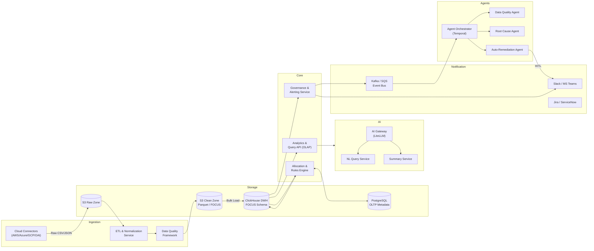
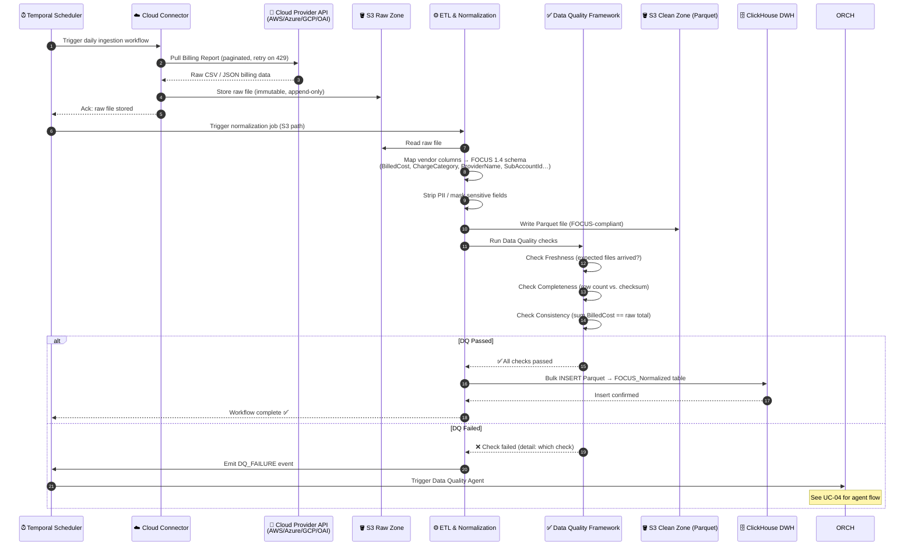
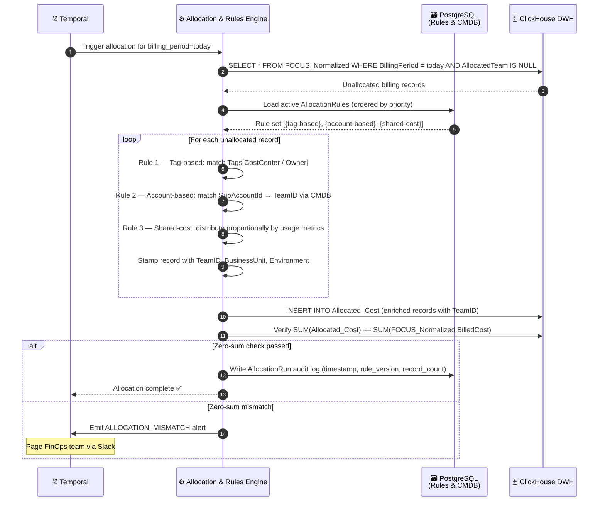
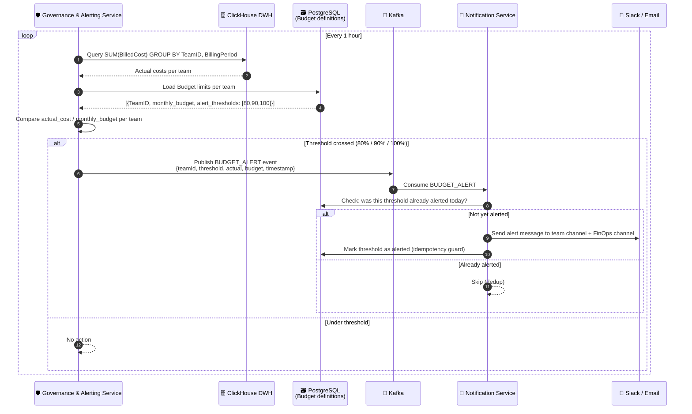
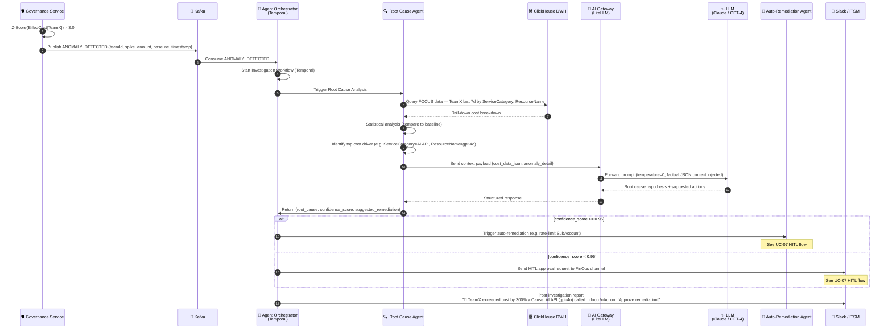
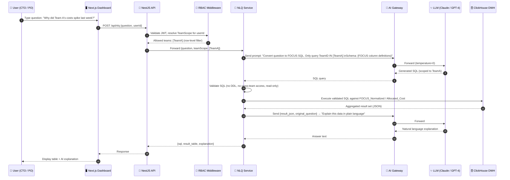
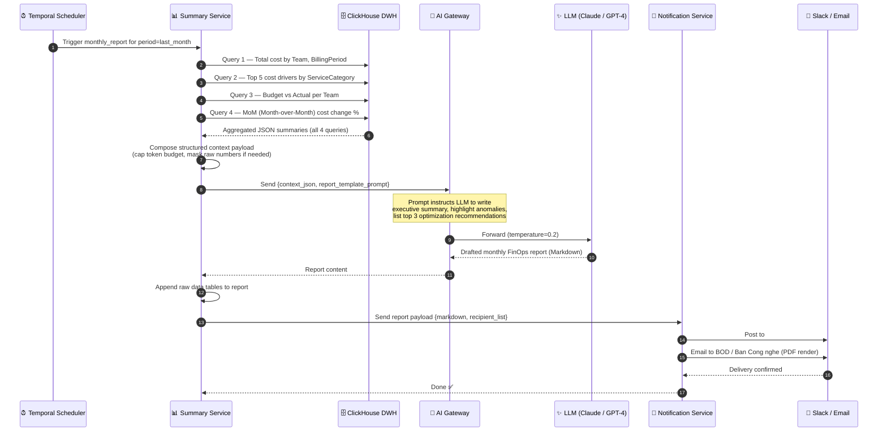
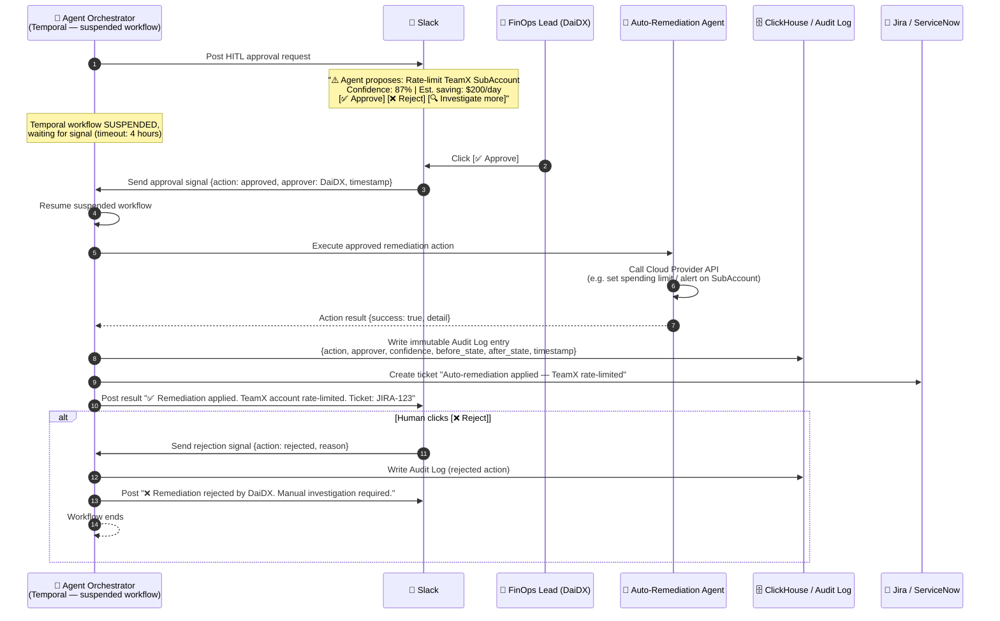

import { Callout, Steps, Tabs, Tab } from 'nextra/components'

# Software Design Document (SDD)

<Callout type="info" emoji="📐">
  This document describes the detailed software design for the **FRT FinOps Platform**, covering component interactions, sequence flows for all major use cases, and API contracts. It serves as the blueprint for the **Execution (Burn)** phase following CTO Review.
</Callout>

---

## 1. Document Scope

This SDD covers the detailed design of the following functional areas:

| # | Use Case | Layer |
| :--- | :--- | :--- |
| UC-01 | Daily Billing Data Ingestion | Data Collection → Core Platform |
| UC-02 | Cost Allocation via Rules Engine | Core Platform |
| UC-03 | Budget Threshold Alert | Core Platform → Notification |
| UC-04 | Anomaly Detection & Agent Investigation | Agent Automation Layer |
| UC-05 | Natural Language Query (NLQ) | AI Intelligence Layer |
| UC-06 | GenAI Automated Monthly Report | AI Intelligence Layer → Notification |
| UC-07 | Human-in-the-Loop (HITL) Approval | Agent Automation Layer |

---

## 2. Component Interaction Overview

Before diving into individual sequence flows, the diagram below shows how the major internal services communicate:

---

## 3. Sequence Diagrams

<Tabs items={['UC-01 Ingestion', 'UC-02 Allocation', 'UC-03 Budget Alert', 'UC-04 Anomaly + Agent', 'UC-05 NLQ', 'UC-06 GenAI Report', 'UC-07 HITL']}>

<Tab>
### UC-01: Daily Billing Data Ingestion

**Trigger:** Temporal cron job fires daily at 02:00 UTC.  
**Actors:** Temporal Scheduler, Cloud Connector, ETL Service, Data Quality Framework, S3, ClickHouse.

</Tab>

<Tab>
### UC-02: Cost Allocation via Rules Engine

**Trigger:** Fires after UC-01 completes successfully (Temporal chained workflow).  
**Actors:** Temporal, Allocation Engine, PostgreSQL (rules store), ClickHouse.

</Tab>

<Tab>
### UC-03: Budget Threshold Alert

**Trigger:** Governance Service polls ClickHouse every 1 hour.  
**Actors:** Governance Service, ClickHouse, Kafka, Slack/Email.

</Tab>

<Tab>
### UC-04: Anomaly Detection & Agent Investigation

**Trigger:** Governance Service detects Z-Score > threshold on BilledCost time series.  
**Actors:** Governance Service, Kafka, Agent Orchestrator (Temporal), Root Cause Agent, LLM (via AI Gateway), Reporting Agent, Slack.

</Tab>

<Tab>
### UC-05: Natural Language Query (NLQ)

**Trigger:** User submits a question via the Dashboard UI.  
**Actors:** User (Engineer / Finance), Next.js UI, NestJS API, NLQ Service, AI Gateway, LLM, ClickHouse.

</Tab>

<Tab>
### UC-06: GenAI Automated Monthly Report

**Trigger:** Temporal cron job fires on the 1st of each month at 08:00 ICT.  
**Actors:** Temporal, Summary Service, ClickHouse, AI Gateway, LLM, Notification Service, Slack/Email.

</Tab>

<Tab>
### UC-07: Human-in-the-Loop (HITL) Approval

**Trigger:** Agent Orchestrator requires human approval before executing a remediation action.  
**Actors:** Agent Orchestrator (Temporal), Slack, FinOps Lead (Human), Auto-Remediation Agent, Audit Log.

</Tab>

</Tabs>

---

## 4. API Contracts (Key Endpoints)

### 4.1 Analytics API

| Method | Endpoint | Description | Auth |
| :--- | :--- | :--- | :--- |
| `GET` | `/api/costs` | Get allocated costs with filters (team, period, env) | JWT + RBAC |
| `GET` | `/api/costs/summary` | Aggregated cost summary by team/service | JWT + RBAC |
| `GET` | `/api/budgets` | Get budget limits and current utilization | JWT + RBAC |
| `POST` | `/api/nlq` | Submit natural language cost question | JWT + RBAC |
| `GET` | `/api/reports/monthly` | Retrieve latest monthly FinOps report | JWT + RBAC |

### 4.2 Admin / FinOps Lead API

| Method | Endpoint | Description | Auth |
| :--- | :--- | :--- | :--- |
| `POST` | `/api/allocation-rules` | Create/update allocation rule | JWT + Admin |
| `GET` | `/api/allocation-rules` | List all active rules with priority order | JWT + Admin |
| `POST` | `/api/budgets` | Set/update budget for a team | JWT + Admin |
| `GET` | `/api/agents/actions` | List pending HITL approval requests | JWT + Admin |
| `POST` | `/api/agents/actions/:id/approve` | Approve a HITL action | JWT + Admin |
| `POST` | `/api/agents/actions/:id/reject` | Reject a HITL action | JWT + Admin |

### 4.3 Webhook / Notification

| Method | Endpoint | Description |
| :--- | :--- | :--- |
| `POST` | `/webhooks/slack/actions` | Receive Slack interactive button callbacks (HITL) |
| `POST` | `/webhooks/ingestion/trigger` | Manually trigger ingestion for a provider |

---

## 5. Error Handling Strategy

| Scenario | Strategy |
| :--- | :--- |
| Cloud Provider API rate limit (429) | Exponential backoff with jitter, max 5 retries |
| DQ check failure | Halt pipeline, emit alert, trigger DQ Agent |
| Allocation zero-sum mismatch | Block Allocated_Cost write, page FinOps Lead |
| LLM hallucination / low confidence | Fall back to pre-templated report, flag for manual review |
| Temporal workflow timeout (HITL > 4h) | Auto-reject action, notify Slack, write audit log |
| Agent action execution failure | Rollback, write audit log, create ITSM ticket |
