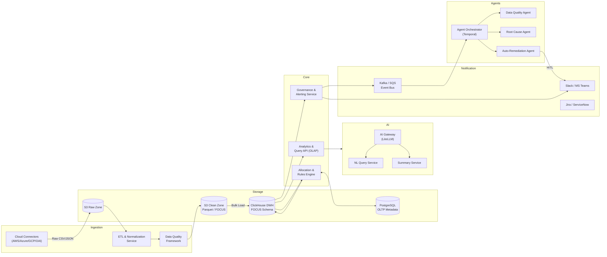
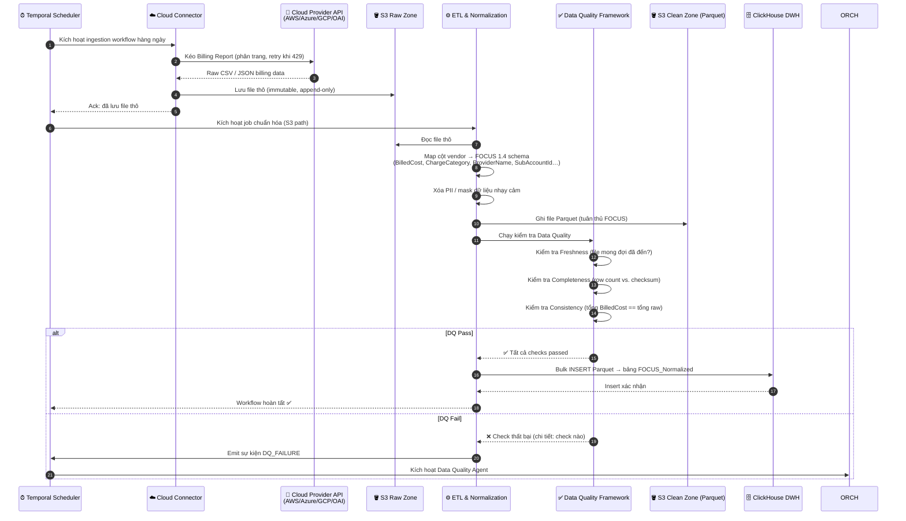
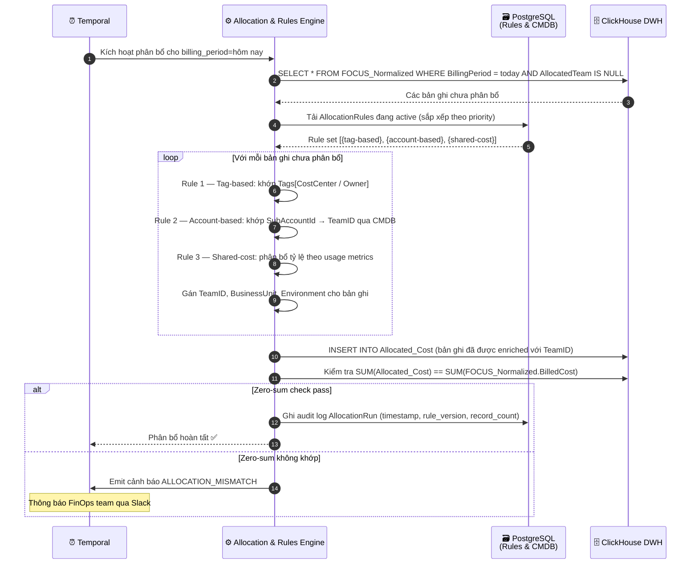
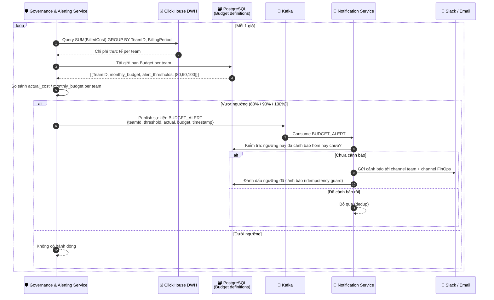
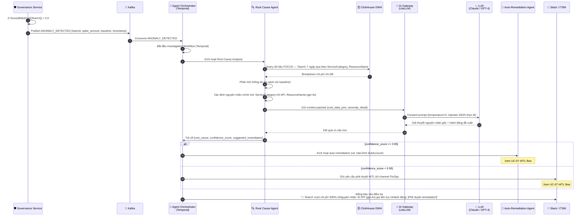
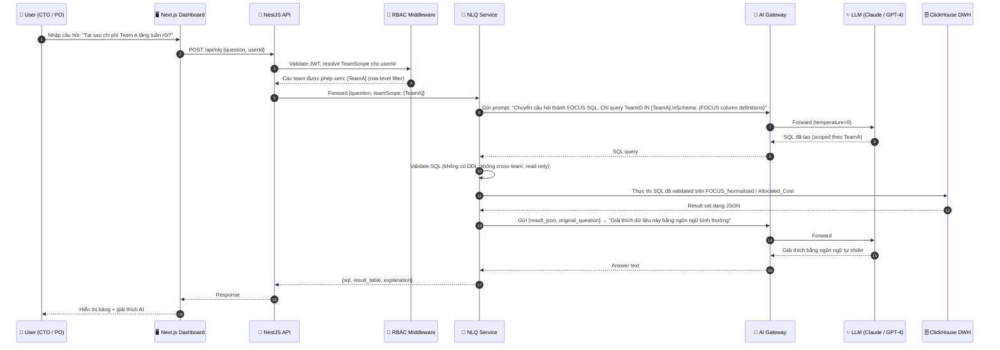
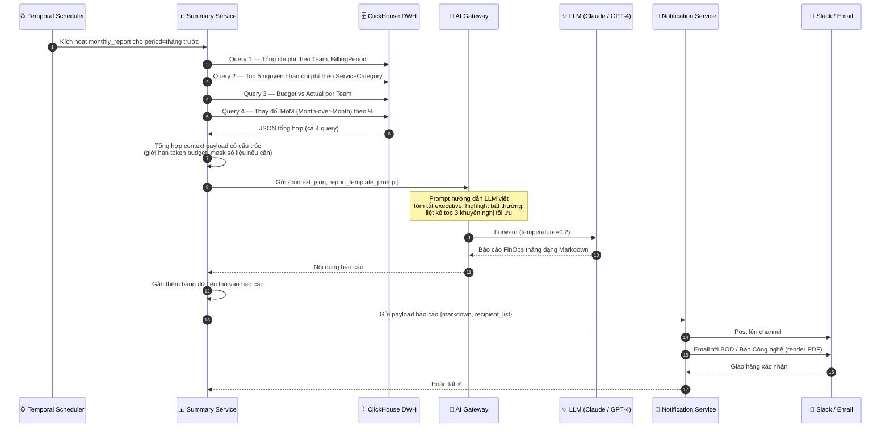
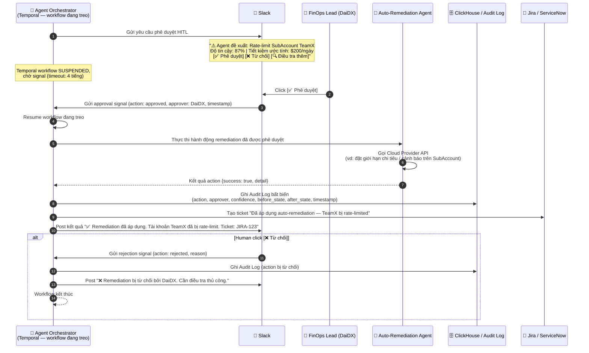

import { Callout, Steps, Tabs, Tab } from 'nextra/components'

# Tài liệu Thiết kế Phần mềm (SDD)

<Callout type="info" emoji="📐">
  Tài liệu này mô tả thiết kế phần mềm chi tiết cho **FRT FinOps Platform**, bao gồm tương tác giữa các component, luồng tuần tự cho tất cả các use case chính, và API contracts. Đây là bản thiết kế cho giai đoạn **Bọn em Burn (Execution)** sau CTO Review.
</Callout>

---

## 1. Phạm vi tài liệu

SDD này bao gồm thiết kế chi tiết cho các functional area sau:

| # | Use Case | Layer |
| :--- | :--- | :--- |
| UC-01 | Ingestion dữ liệu Billing hàng ngày | Data Collection → Core Platform |
| UC-02 | Phân bổ chi phí qua Rules Engine | Core Platform |
| UC-03 | Cảnh báo ngưỡng ngân sách | Core Platform → Notification |
| UC-04 | Phát hiện bất thường & Agent điều tra | Agent Automation Layer |
| UC-05 | Truy vấn ngôn ngữ tự nhiên (NLQ) | AI Intelligence Layer |
| UC-06 | GenAI tự động báo cáo tháng | AI Intelligence Layer → Notification |
| UC-07 | Phê duyệt Human-in-the-Loop (HITL) | Agent Automation Layer |

---

## 2. Tổng quan tương tác Component

---

## 3. Sequence Diagrams

<Tabs items={['UC-01 Ingestion', 'UC-02 Phân bổ', 'UC-03 Budget Alert', 'UC-04 Anomaly + Agent', 'UC-05 NLQ', 'UC-06 GenAI Report', 'UC-07 HITL']}>

<Tab>
### UC-01: Ingestion dữ liệu Billing hàng ngày

**Trigger:** Temporal cron job chạy mỗi ngày lúc 02:00 UTC.

</Tab>

<Tab>
### UC-02: Phân bổ chi phí qua Rules Engine

**Trigger:** Chạy sau khi UC-01 hoàn tất thành công (Temporal chained workflow).

</Tab>

<Tab>
### UC-03: Cảnh báo ngưỡng ngân sách

**Trigger:** Governance Service poll ClickHouse mỗi 1 giờ.

</Tab>

<Tab>
### UC-04: Phát hiện bất thường & Agent điều tra

**Trigger:** Governance Service phát hiện Z-Score > ngưỡng trên time series BilledCost.

</Tab>

<Tab>
### UC-05: Truy vấn ngôn ngữ tự nhiên (NLQ)

**Trigger:** User gửi câu hỏi qua Dashboard UI.

</Tab>

<Tab>
### UC-06: GenAI tự động báo cáo tháng

**Trigger:** Temporal cron job chạy vào ngày 1 hàng tháng lúc 08:00 ICT.

</Tab>

<Tab>
### UC-07: Phê duyệt Human-in-the-Loop (HITL)

**Trigger:** Agent Orchestrator cần phê duyệt từ người trước khi thực hiện remediation.

</Tab>

</Tabs>

---

## 4. API Contracts (Các endpoint chính)

### 4.1 Analytics API

| Method | Endpoint | Mô tả | Auth |
| :--- | :--- | :--- | :--- |
| `GET` | `/api/costs` | Lấy chi phí đã phân bổ theo filter (team, period, env) | JWT + RBAC |
| `GET` | `/api/costs/summary` | Tổng hợp chi phí theo team/service | JWT + RBAC |
| `GET` | `/api/budgets` | Lấy giới hạn ngân sách và mức sử dụng hiện tại | JWT + RBAC |
| `POST` | `/api/nlq` | Gửi câu hỏi chi phí bằng ngôn ngữ tự nhiên | JWT + RBAC |
| `GET` | `/api/reports/monthly` | Lấy báo cáo FinOps tháng mới nhất | JWT + RBAC |

### 4.2 Admin / FinOps Lead API

| Method | Endpoint | Mô tả | Auth |
| :--- | :--- | :--- | :--- |
| `POST` | `/api/allocation-rules` | Tạo/cập nhật allocation rule | JWT + Admin |
| `GET` | `/api/allocation-rules` | Danh sách tất cả rules đang active theo priority | JWT + Admin |
| `POST` | `/api/budgets` | Đặt/cập nhật budget cho team | JWT + Admin |
| `GET` | `/api/agents/actions` | Danh sách yêu cầu HITL đang chờ phê duyệt | JWT + Admin |
| `POST` | `/api/agents/actions/:id/approve` | Phê duyệt HITL action | JWT + Admin |
| `POST` | `/api/agents/actions/:id/reject` | Từ chối HITL action | JWT + Admin |

---

## 5. Chiến lược xử lý lỗi

| Tình huống | Chiến lược |
| :--- | :--- |
| Cloud Provider API rate limit (429) | Exponential backoff với jitter, tối đa 5 lần retry |
| DQ check thất bại | Dừng pipeline, emit cảnh báo, kích hoạt DQ Agent |
| Allocation zero-sum không khớp | Chặn ghi Allocated_Cost, thông báo FinOps Lead |
| LLM hallucination / độ tin cậy thấp | Fallback về báo cáo template định sẵn, đánh dấu cần review thủ công |
| Temporal workflow timeout (HITL > 4h) | Tự động từ chối action, thông báo Slack, ghi audit log |
| Agent action thực thi thất bại | Rollback, ghi audit log, tạo ITSM ticket |
