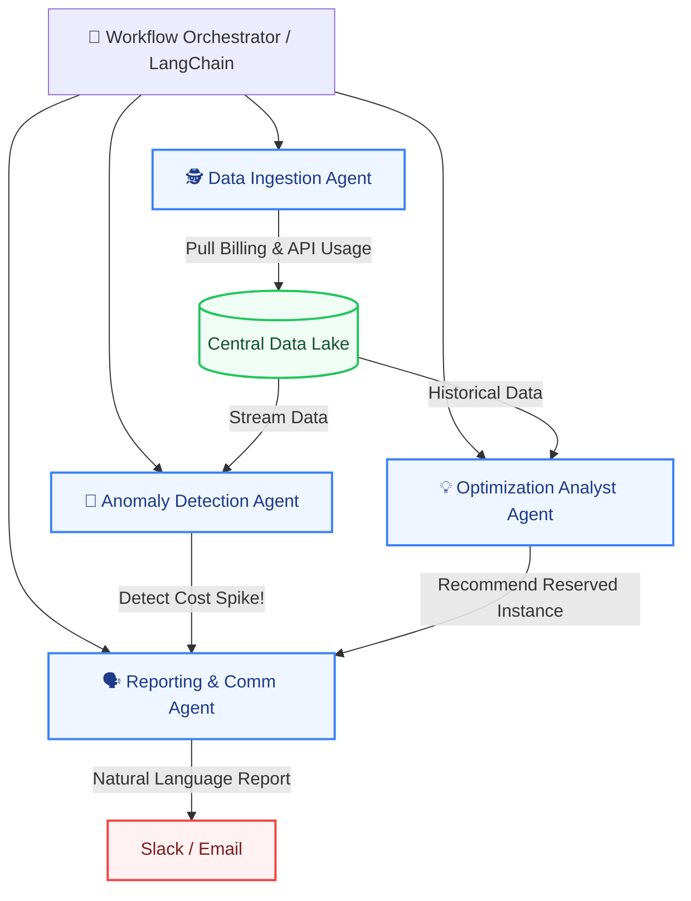

import { Callout, Cards, Card, Steps } from 'nextra/components'

# Multi-Agent Automation Architecture Proposal

<Callout type="info" emoji="🤖">
  **Autonomous FinOps Vision:** Instead of relying on rigid cronjob scripts, the FRT FinOps system will be designed upon a **Multi-Agent** architecture. The collaboration of multiple specialized AI Agents helps automate the entire workflow from data ingestion, anomaly detection, root cause analysis, to providing optimization recommendations.
</Callout>

The Multi-Agent architecture allows the system to operate as a "Virtual FinOps Team", where each Agent takes on a specific role, communicates with others, and autonomously makes decisions based on real-time data.

## 1. Architecture Diagram (Multi-Agent Workflow)

Below is the communication model between Agents within the FinOps system:

## 2. Roles of Each Automation Agent

The system comprises 4 primary Agents, working in parallel and interacting with each other:

<Cards>
  <Card icon="🕵️" title="Data Ingestion Agent" href="#">
    **Mission:** Automate data collection.  
    This Agent continuously makes API calls to AWS, Azure, and OpenAI to pull usage logs. It possesses self-healing capabilities (retries) when hitting API rate limits or encountering corrupted payload data.
  </Card>
  <Card icon="🚨" title="Anomaly Detection Agent" href="#">
    **Mission:** The Budget "Gatekeeper".  
    Runs machine learning statistical models to analyze data in real-time. If a service's cost spikes deviating significantly from the baseline, this Agent immediately triggers an alarm.
  </Card>
  <Card icon="💡" title="Optimization Analyst Agent" href="#">
    **Mission:** Cost Optimization Advisor.  
    Scans historical data to locate "idle resources" or formulate saving strategies (e.g., "If we purchase an AWS Savings Plan right now, Team A will save 30% next month").
  </Card>
  <Card icon="🗣️" title="Reporting & Comm Agent" href="#">
    **Mission:** The Spokesperson (GenAI).  
    Utilizes LLMs (GPT-4o/Claude) to translate dry metrics into human-readable language. Receives signals from other Agents and drafts friendly reports/alerts sent to Slack.
  </Card>
</Cards>

## 3. Practical Workflow: Incident Handling

To better visualize, below is a Workflow when an unexpected cost spike occurs, illustrating how the Agents automatically coordinate:

<Steps>
### Step 1: Data Collection (Continuous)
The **Data Ingestion Agent** detects that Product Team X's API Usage for OpenAI services surged in the early hours. It pushes the raw data into the Data Lake.

### Step 2: Trigger Alerts (Real-time)
The **Anomaly Detection Agent** is monitoring the Data Lake. It notices Team X's cost jumped 300% compared to the 7-day moving average. It immediately creates an `Alert Event` and drops it into the Message Queue.

### Step 3: Root Cause Analysis
The **Optimization Analyst Agent** receives the `Alert Event`. It queries deep into Team X's logs and discovers the root cause is *an infinite loop code running GPT-4 API calls*. It packages this finding.

### Step 4: Human Notification (Actionable Alert)
The **Reporting Agent** receives the "Root Cause" from the Analyst Agent. Instead of dumping a JSON log file into Slack, it uses a Prompt to craft an urgent, friendly message:
> *"🚨 **Alert:** Product Team X is exceeding their OpenAI cost by 300% ($500 consumed in the last 2 hours). Suspected cause: An infinite loop calling the GPT-4 API. Please review the codebase immediately!"*

### Step 5: Auto-Remediation (Optional)
If granted permissions, the Orchestrator can automatically make an API call to temporarily Rate-limit Team X's OpenAI account until Devs fix the bug, preventing thousands of dollars wasted overnight.
</Steps>

## 4. Value Delivered to the Organization
Adopting a Multi-Agent Workflow helps FRT:
1. **Minimize Downtime:** Machines monitor 24/7 and alert instantly; humans only need to make decisions based on reports already "digested" by AI.
2. **Eliminate Bottlenecks:** The FinOps Team (currently only 1.5 FTEs) is not overwhelmed by manual log checking.
3. **Flexible Scalability:** When introducing a new cloud provider (e.g., Google Cloud), simply add a new `Data Ingestion Agent` without breaking the core alerting logic.
