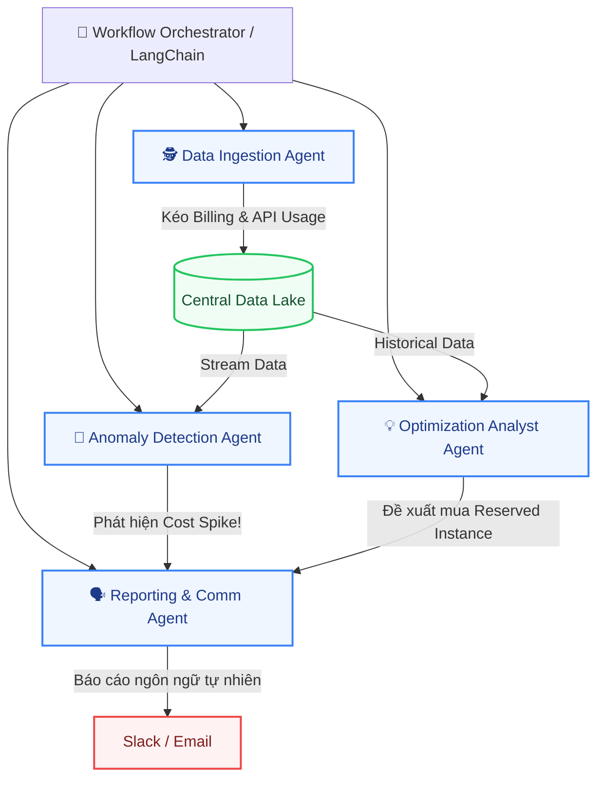

import { Callout, Cards, Card, Steps } from 'nextra/components'

# Đề xuất Kiến trúc Multi-Agent Automation

<Callout type="info" emoji="🤖">
  **Tầm nhìn Tự động hóa (Autonomous FinOps):** Thay vì sử dụng các script cronjob cứng nhắc, hệ thống FRT FinOps sẽ được thiết kế dựa trên kiến trúc **Multi-Agent** (Đa tác tử). Sự kết hợp của nhiều AI Agents chuyên biệt giúp tự động hóa toàn bộ Workflow từ thu thập dữ liệu, phát hiện bất thường, phân tích nguyên nhân đến đưa ra khuyến nghị tối ưu.
</Callout>

Kiến trúc Multi-Agent cho phép hệ thống hoạt động như một "Đội ngũ Ảo" (Virtual FinOps Team), nơi mỗi Agent đảm nhận một vai trò cụ thể, giao tiếp với nhau và tự chủ đưa ra quyết định dựa trên dữ liệu thời gian thực.

## 1. Sơ đồ Kiến trúc (Multi-Agent Workflow)

Dưới đây là mô hình giao tiếp giữa các Agents trong hệ thống FinOps:

## 2. Vai trò của từng Automation Agent

Hệ thống bao gồm 4 Tác tử (Agents) chính, hoạt động song song và tương tác qua lại:

<Cards>
  <Card icon="🕵️" title="Data Ingestion Agent" href="#">
    **Nhiệm vụ:** Tự động hóa việc thu thập dữ liệu.  
    Agent này liên tục gọi API đến AWS, Azure, OpenAI để kéo log sử dụng. Nó có khả năng tự xử lý lỗi (retry) khi API rate limit hoặc data trả về bị hỏng.
  </Card>
  <Card icon="🚨" title="Anomaly Detection Agent" href="#">
    **Nhiệm vụ:** "Người gác cổng" ngân sách.  
    Chạy các model thống kê học máy (Machine Learning) để phân tích real-time. Nếu chi phí của một service tăng vọt sai lệch so với baseline, Agent này lập tức kích hoạt chuông báo động.
  </Card>
  <Card icon="💡" title="Optimization Analyst Agent" href="#">
    **Nhiệm vụ:** Cố vấn tối ưu chi phí.  
    Quét dữ liệu lịch sử để tìm kiếm "tài nguyên rác" (idle resources) hoặc đưa ra chiến lược tiết kiệm (vd: "Nếu mua AWS Savings Plan ngay bây giờ, team A sẽ tiết kiệm được 30% tháng tới").
  </Card>
  <Card icon="🗣️" title="Reporting & Comm Agent" href="#">
    **Nhiệm vụ:** Phát ngôn viên (GenAI).  
    Sử dụng LLM (GPT-4o/Claude) để dịch các số liệu khô khan thành ngôn ngữ con người. Nhận tín hiệu từ các Agent khác và viết báo cáo/cảnh báo thân thiện gửi lên Slack.
  </Card>
</Cards>

## 3. Workflow Thực tế: Xử lý Bất thường (Incident Handling)

Để hình dung rõ hơn, dưới đây là một "Tiến trình" (Workflow) khi có sự cố tăng chi phí đột biến xảy ra, minh họa cách các Agent phối hợp tự động:

<Steps>
### Bước 1: Thu thập Dữ liệu (Continuous)
**Data Ingestion Agent** phát hiện API Usage của Team Product X đối với dịch vụ OpenAI tăng vọt vào rạng sáng. Nó đẩy dữ liệu thô vào Data Lake.

### Bước 2: Kích hoạt Cảnh báo (Real-time)
**Anomaly Detection Agent** đang trực (monitor) Data Lake. Nó nhận thấy chi phí của Team X tăng 300% so với trung bình 7 ngày qua. Nó lập tức tạo một `Alert Event` và gửi vào hàng đợi (Message Queue).

### Bước 3: Phân tích Nguyên nhân (Analysis)
**Optimization Analyst Agent** nhận được `Alert Event`. Nó truy vấn sâu vào log của Team X và phát hiện nguyên nhân là do *một đoạn code chạy loop vô hạn gọi API GPT-4*. Nó đóng gói nguyên nhân này lại.

### Bước 4: Thông báo cho Con người (Actionable Alert)
**Reporting Agent** nhận "Nguyên nhân" từ Analyst Agent. Thay vì ném một file log JSON ra Slack, nó dùng Prompt để soạn một tin nhắn khẩn cấp thân thiện:
> *"🚨 **Cảnh báo:** Team Product X đang bị vượt chi phí OpenAI 300% (Tiêu tốn $500 trong 2 giờ qua). Nguyên nhân nghi ngờ: Có một vòng lặp vô hạn đang gọi API GPT-4. Các bạn check lại code ngay nhé!"*

### Bước 5: Phản hồi tự động (Optional)
Nếu được cấp quyền (Auto-remediation), Orchestrator có thể tự động gọi API để giới hạn (Rate-limit) account OpenAI của Team X tạm thời cho đến khi Dev vào fix bug, ngăn chặn lãng phí hàng nghìn Đô la trong đêm.
</Steps>

## 4. Giá trị mang lại cho Tổ chức
Sử dụng Multi-Agent Workflow giúp FRT:
1. **Giảm thiểu thời gian chết:** Máy móc giám sát 24/7 và cảnh báo ngay lập tức, con người chỉ cần ra quyết định dựa trên báo cáo đã được AI "nhai sẵn".
2. **Loại bỏ Bottleneck:** Team FinOps (hiện tại chỉ có 1.5 FTE) không bị quá tải bởi việc check log thủ công.
3. **Mở rộng linh hoạt (Scalable):** Khi có thêm cloud mới (ví dụ Google Cloud), chỉ cần thêm một `Data Ingestion Agent` mới mà không phá vỡ logic cảnh báo cốt lõi.
