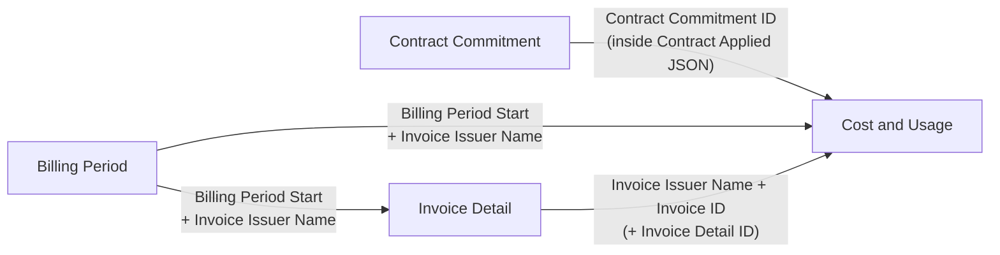

import { Callout, Cards, Card } from 'nextra/components'

# FOCUS Framework — v1.4 Data Model

<Callout type="info" emoji="🌟">
  **FOCUS (FinOps Open Cost & Usage Specification)** normalizes billing data from every provider (Cloud, SaaS, AI...) into one common format. This section focuses on the **FOCUS v1.4 data model**: the four datasets, how they relate, and the [detailed column library](/finops-framework/focus-framework/focus-columns-library).
</Callout>

<Callout type="default" emoji="🔗">
  Need the high-level introduction (the problem FOCUS solves, the ecosystem, benefits for FRT FinOps)? See [FOCUS Open Standard](/finops-framework/focus-open-billing-standard) under FinOps Framework.
</Callout>

---

## 1. What's new in FOCUS v1.4

FOCUS v1.4 (released 06/2026) expands from a single cost table into **four cooperating datasets**, building a bridge to Finance / Accounts Payable:

- **Invoice Detail** *(new)* — reconcile usage directly against the physical invoice.
- **Billing Period** *(new)* — define billing cycle boundaries and close-out status.
- **Contract Commitment** *(expanded)* — from 13 to 30 columns describing the full anatomy of a commitment.
- **Cost and Usage** — the primary dataset, now with invoice references (`InvoiceId`, `InvoiceDetailId`).

---

## 2. The four datasets and their purpose

| Dataset | Type | Answers the question | Columns |
| :--- | :--- | :--- | :--- |
| **Cost and Usage** | Transactional (primary) | "What did I use/buy, how much, at what price?" | 65 |
| **Invoice Detail** | Transactional | "What does the actual invoice (financial record) say?" | 22 |
| **Billing Period** | Supporting (lookup) | "When does the billing period start/end, is it closed?" | 6 |
| **Contract Commitment** | Supporting (lookup) | "What contractual commitments did I make with the provider?" | 30 |

---

## 3. How the four datasets relate

- **Cost and Usage ↔ Contract Commitment**: via `Contract Commitment ID` (in Cost and Usage it lives inside the `Contract Applied` JSON).
- **Billing Period ↔ Cost and Usage / Invoice Detail**: via `Billing Period Start` + `Invoice Issuer Name`.
- **Invoice Detail ↔ Cost and Usage**: via `Invoice Issuer Name` + `Invoice ID` (optionally `Invoice Detail ID`).

---

## 4. Read next

<Cards>
  <Card icon="🗂️" title="Column Library (v1.4)" href="/finops-framework/focus-framework/focus-columns-library">
    The full mind map: each dataset → column group → the purpose of every column (123 columns).
  </Card>
  <Card icon="🧭" title="FOCUS Open Standard" href="/finops-framework/focus-open-billing-standard">
    Context, the Generators/Consumers ecosystem, and strategic benefits for FRT FinOps.
  </Card>
  <Card icon="🔌" title="FPT Cloud → FOCUS Mapping" href="/service-catalog/focus-mapping">
    How the connector maps FPT Cloud data into the FOCUS 1.4 schema.
  </Card>
</Cards>
