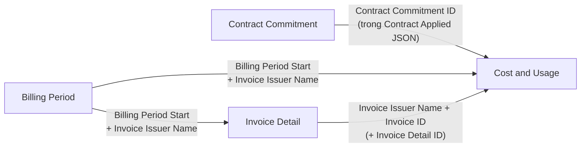

import { Callout, Cards, Card } from 'nextra/components'

# FOCUS Framework — Mô hình dữ liệu v1.4

<Callout type="info" emoji="🌟">
  **FOCUS (FinOps Open Cost & Usage Specification)** chuẩn hoá dữ liệu billing từ mọi nhà cung cấp (Cloud, SaaS, AI...) về một định dạng chung. Phần này tập trung vào **mô hình dữ liệu của FOCUS v1.4**: 4 dataset, cách chúng liên kết, và [thư viện cột chi tiết](/finops-framework/focus-framework/focus-columns-library).
</Callout>

<Callout type="default" emoji="🔗">
  Cần phần giới thiệu tổng quan (vấn đề FOCUS giải quyết, hệ sinh thái, lợi ích cho FRT FinOps)? Xem [FOCUS Open Standard](/finops-framework/focus-open-billing-standard) trong mục FinOps Framework.
</Callout>

---

## 1. FOCUS v1.4 có gì mới

FOCUS v1.4 (phát hành 06/2026) mở rộng từ một bảng chi phí đơn lẻ thành **4 dataset** phối hợp với nhau, đặc biệt tạo cầu nối với bộ phận Tài chính / Accounts Payable:

- **Invoice Detail** *(mới)* — đối soát usage trực tiếp với hoá đơn vật lý.
- **Billing Period** *(mới)* — định nghĩa ranh giới và trạng thái chốt sổ của kỳ billing.
- **Contract Commitment** *(mở rộng)* — từ 13 lên 30 cột, mô tả đầy đủ điều khoản cam kết.
- **Cost and Usage** — dataset chính, bổ sung tham chiếu hoá đơn (`InvoiceId`, `InvoiceDetailId`).

---

## 2. Bốn dataset và nhiệm vụ

| Dataset | Loại | Trả lời câu hỏi | Số cột |
| :--- | :--- | :--- | :--- |
| **Cost and Usage** | Transactional (chính) | "Tôi đã dùng/mua gì, hết bao nhiêu, theo giá nào?" | 65 |
| **Invoice Detail** | Transactional | "Hoá đơn thực tế (chứng từ tài chính) ghi gì?" | 22 |
| **Billing Period** | Supporting (tra cứu) | "Kỳ billing bắt đầu/kết thúc khi nào, chốt sổ chưa?" | 6 |
| **Contract Commitment** | Supporting (tra cứu) | "Tôi đã cam kết hợp đồng gì với nhà cung cấp?" | 30 |

---

## 3. Cách 4 dataset liên kết

- **Cost and Usage ↔ Contract Commitment**: qua `Contract Commitment ID` (ở Cost and Usage nằm trong JSON `Contract Applied`).
- **Billing Period ↔ Cost and Usage / Invoice Detail**: qua `Billing Period Start` + `Invoice Issuer Name`.
- **Invoice Detail ↔ Cost and Usage**: qua `Invoice Issuer Name` + `Invoice ID` (tuỳ chọn thêm `Invoice Detail ID`).

---

## 4. Đọc tiếp

<Cards>
  <Card icon="🗂️" title="Thư viện Cột (v1.4)" href="/finops-framework/focus-framework/focus-columns-library">
    Sơ đồ tư duy đầy đủ: từng dataset → nhóm cột → nhiệm vụ của từng cột (123 cột).
  </Card>
  <Card icon="🧭" title="FOCUS Open Standard" href="/finops-framework/focus-open-billing-standard">
    Bối cảnh, hệ sinh thái Generators/Consumers và lợi ích chiến lược cho FRT FinOps.
  </Card>
  <Card icon="🔌" title="FPT Cloud → FOCUS Mapping" href="/service-catalog/focus-mapping">
    Cách connector map dữ liệu FPT Cloud sang schema FOCUS 1.4.
  </Card>
</Cards>
