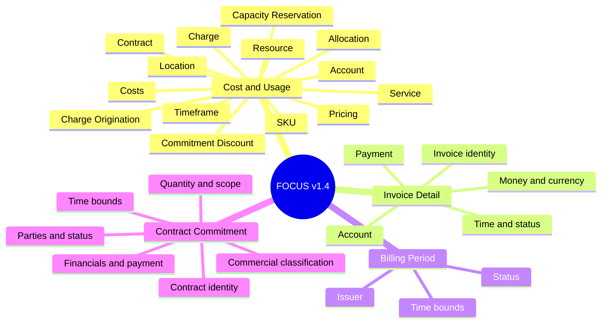

import { Callout } from 'nextra/components'

# FOCUS v1.4 Column Library — Mind Map

<Callout type="info" emoji="🗂️">
  This mind map systematizes all **123 columns** of FOCUS v1.4 across three levels: **dataset → column group → individual column**. Source: FOCUS_Spec tag `v1.4`.
</Callout>

## Overview: 4 datasets → column groups

<Callout type="default" emoji="🔗">
  The join relationships between datasets are on the [Introduction page](/finops-framework/focus-framework).
</Callout>

---

## 1. Billing Period (6 columns)

**Purpose:** Describes the time intervals and statuses of an invoice issuer's billing cycles. A lookup dataset that tells you whether Cost and Usage / Invoice Detail data for a period is **preliminary** or **finalized** — supporting financial reporting and showback/chargeback.

**Time bounds**
- **Billing Period Start** — Inclusive start bound of the billing period.
- **Billing Period End** — Exclusive end bound of the billing period.
- **Billing Period Created** — When the billing period record was first created (lifecycle auditability).
- **Billing Period Last Updated** — When the record was last updated (ensures you use the latest version).

**Status**
- **Billing Period Status** — Period state ("Open"/"Closed"): whether data can still change or is final.

**Issuer**
- **Invoice Issuer Name** — Entity responsible for issuing invoices for this period (also a join key).

---

## 2. Contract Commitment (30 columns)

**Purpose:** Describes the terms of contracts agreed between a provider and a customer (spend/usage commitments, payment models, lifecycle, discount rates...). Lets you **compare commitment structures across providers** from one dataset.

**Contract & commitment identity**
- **Contract ID** — Provider-assigned identifier for the contract.
- **Contract Commitment ID** — Identifier of a specific commitment term (join key to Cost and Usage).
- **Contract Commitment Type** — Provider-specific display name for the commitment type (not a code).
- **Contract Commitment Description** — Self-contained summary of the terms when other columns are insufficient.

**Commercial classification**
- **Contract Commitment Category** — Highest-level classification by how the commitment applies to a charge.
- **Contract Commitment Benefit Category** — Primary benefit (price reduction / feature entitlement / availability guarantee...).
- **Contract Commitment Offer Category** — Terms are "Public" (rate card) or "Negotiated" (private).
- **Contract Commitment Model** — Consumption behavior: "Continuous" (use-it-or-lose-it) vs "Discontinuous" (flexible aggregate).
- **Contract Commitment Duration Type** — Nominal length (e.g. "1 Year", "3 Years"), stable regardless of lifecycle events.
- **Contract Commitment Fulfillment Interval** — Window used to measure and reset commitment fulfillment (Continuous usually Hourly; Discontinuous Daily or greater).

**Financials & payment**
- **Contract Commitment Cost** — Monetary value of the commitment (tracks fulfillment progress).
- **Contract Commitment Discount Percentage** — Effective % reduction off list price for covered usage.
- **Contract Commitment Payment Model** — Settlement structure: No Upfront / Partial Upfront / All Upfront.
- **Contract Commitment Payment Interval** — Billing frequency for the commitment (distinct from Fulfillment Interval).
- **Contract Commitment Payment Upfront Percentage** — % of total cost paid upfront (for Partial Upfront models).
- **Billing Currency** — Billing currency of the commitment.
- **Pricing Currency** — Pricing currency of the commitment (when pricing and billing differ).
- **Pricing Currency Contract Commitment Cost** — Commitment value in Pricing Currency (independent of FX).

**Quantity & scope**
- **Contract Commitment Quantity** — Committed amount, in a provider-defined unit.
- **Contract Commitment Unit** — Measurement unit for Contract Commitment Quantity.
- **Contract Commitment Applicability** — JSON defining which entities are eligible for coverage (include/exclude logic).

**Time bounds**
- **Contract Period Start / End** — Inclusive start / exclusive end of the contract.
- **Contract Commitment Period Start / End** — Start/end of the commitment itself.
- **Contract Commitment Created** — When the commitment record was first created.
- **Contract Commitment Last Updated** — When it was last updated.

**Parties & status**
- **Service Provider Name** — Entity providing the resources/services, responsible for honoring the commitment.
- **Invoice Issuer Name** — Entity issuing invoices for the commitment.
- **Contract Commitment Lifecycle Status** — Current lifecycle state (determines applicability to a data period).

---

## 3. Cost and Usage (65 columns) — the primary dataset

**Purpose:** Describes the cost and usage incurred when using/buying resources or services. Contains **dimensions** (qualitative, for filtering/grouping) and **metrics** (numeric, for aggregation). It is the foundation for most FinOps capabilities.

**Account (6) — account structure**
- **Billing Account ID** — Identifier of the billing account (the invoiced root).
- **Billing Account Name** — Display name of the billing account.
- **Billing Account Type** — Type of billing account (display name, not a code).
- **Sub Account ID** — Identifier of a sub account (e.g. subscription/project) under the billing account.
- **Sub Account Name** — Display name of the sub account.
- **Sub Account Type** — Type of sub account.

**Allocation (5) — split cost allocation**
- **Allocated Method Details** — JSON describing the factors that determined the cost split.
- **Allocated Method ID** — Identifier of the provider-defined allocation method.
- **Allocated Resource ID** — The target resource the cost is allocated to (differs from the original Resource ID).
- **Allocated Resource Name** — Display name of the allocation target.
- **Allocated Tags** — Tags specific to allocated charges.

**Costs / Billing (9) — cost & usage measures**
- **Billed Cost** — Cost **as invoiced** in the period (cash-based; invoice reconciliation).
- **Effective Cost** — Cost **recognized/amortized** in the period (accrual-based; amortizes prepaid/commitments).
- **List Cost** — Cost at list price = List Unit Price × Pricing Quantity (savings baseline).
- **Contracted Cost** — Cost at negotiated price = Contracted Unit Price × Pricing Quantity.
- **List Unit Price** — Published unit price, before discounts, in Billing Currency.
- **Contracted Unit Price** — Unit price incl. negotiated discounts (excl. commitment discounts).
- **Billing Currency** — Currency used for billing.
- **Consumed Quantity** — Actual SKU volume consumed (by Consumed Unit; consumption-focused).
- **Consumed Unit** — Unit of measure for consumption (e.g. GB-Hours).

**Pricing (7) — pricing**
- **Pricing Category** — Pricing model at the time of use/purchase (On-Demand, Committed...).
- **Pricing Quantity** — SKU volume used for **pricing** (may differ from Consumed Quantity granularity).
- **Pricing Unit** — Unit used to determine unit prices (after rules like block pricing).
- **Pricing Currency** — Currency used for pricing (when different from Billing Currency).
- **Pricing Currency Effective Cost** — Effective Cost expressed in Pricing Currency.
- **Pricing Currency Contracted Unit Price** — Contracted Unit Price in Pricing Currency.
- **Pricing Currency List Unit Price** — List Unit Price in Pricing Currency.

**SKU (4) — goods/service identity**
- **SKU ID** — Identifier of a SKU (functional/technical spec), stable across price variations.
- **SKU Meter** — The functionality being metered for the SKU in a charge.
- **SKU Price ID** — Identifier of a specific SKU price in the price list.
- **SKU Price Details** — JSON of stable SKU price properties (period, tier...).

**Charge (4) — nature of the charge**
- **Charge Category** — Highest-level classification by how it is billed (Usage, Purchase, Tax, Credit, Adjustment).
- **Charge Class** — Whether the charge is a **correction** to a closed period.
- **Charge Description** — Self-contained summary of the charge's purpose and price.
- **Charge Frequency** — How often the charge occurs (one-time, recurring, usage-based).

**Charge Origination (5) — origin & documents**
- **Service Provider Name** — Entity providing the resource/service (the seller in marketplaces).
- **Host Provider Name** — Entity providing the underlying infrastructure.
- **Invoice Issuer Name** — Entity issuing invoices (join key to Invoice Detail/Billing Period).
- **Invoice ID** — Identifier of the invoice containing this charge.
- **Invoice Detail ID** — Identifier of the invoice line item for this charge.

**Commitment Discount (8) — commitment-based discounts**
- **Commitment Discount ID** — Provider-assigned identifier of the commitment discount.
- **Commitment Discount Name** — Display name of the commitment discount.
- **Commitment Discount Type** — Type of commitment discount (e.g. Reserved, Savings Plan).
- **Commitment Discount Category** — Commitment based on "Usage" or "Spend".
- **Commitment Discount Status** — Whether the charge is the **used** or **unused** portion of the commitment.
- **Commitment Discount Quantity** — Amount purchased/consumed (by Commitment Discount Unit).
- **Commitment Discount Unit** — Measurement unit for Commitment Discount Quantity.
- **Commitment Program Eligibility Details** — JSON of programs that **could** cover the charge (coverage denominator).

**Contract (1) — contract linkage**
- **Contract Applied** — JSON linking the charge to one/more contract commitments (join key to Contract Commitment).

**Capacity Reservation (2) — reserved capacity**
- **Capacity Reservation ID** — Identifier of the capacity reservation.
- **Capacity Reservation Status** — Whether the charge is **consumption** or the **unused** portion of the reservation.

**Service (3) — service classification**
- **Service Category** — Highest-level classification by core function (exactly one per service).
- **Service Subcategory** — Secondary classification within Service Category.
- **Service Name** — Display name of the purchased offering.

**Resource (4) — resources & tagging**
- **Resource ID** — Provider-assigned identifier of a resource.
- **Resource Name** — Display name of the resource.
- **Resource Type** — Kind of resource (Virtual Machine, Data Warehouse, Load Balancer...).
- **Tags** — Set of tags (provider/user-defined) adding business context for allocation.

**Location (3) — deployment location**
- **Region ID** — Identifier of the geographic region where the resource is provisioned.
- **Region Name** — Display name of the region.
- **Availability Zone** — Isolated area within a Region (cross-zone cost/transfer analysis).

**Timeframe (4) — time bounds**
- **Charge Period Start** — Inclusive start bound of the charge.
- **Charge Period End** — Exclusive end bound of the charge.
- **Billing Period Start** — Inclusive start of the billing period containing the charge.
- **Billing Period End** — Exclusive end of the billing period.

---

## 4. Invoice Detail (22 columns)

**Purpose:** Records the **financial record** — charges exactly as they appear on invoices issued by the invoice issuer. Supports financial reconciliation, tax reporting, and payment processing; the "bridge" to Finance/AP, complementing the granular Cost and Usage view.

**Invoice & line-item identity**
- **Invoice ID** — Identifier of the invoice (groups the period's charges for a billing account).
- **Invoice Detail ID** — Identifier of an invoice line item (maps line item ↔ granular data).
- **Reference Invoice ID** — Points to a prior invoice being adjusted (credit/refund/correction) — lineage.
- **Invoice Detail Description** — Issuer-provided description of the line item.
- **Invoice Detail Grain** — JSON defining the line item's granularity (SKU/service/resource/custom).

**Money & currency**
- **Billed Cost** — Cost as invoiced (in Billing Currency).
- **Billing Currency** — Billing currency.
- **Payment Currency** — Currency the issuer requires for **settlement** (may differ from Billing Currency).
- **Payment Currency Billed Cost** — Billed Cost expressed in Payment Currency.
- **Payment Currency Invoice Detail ID** — Points to the record where Payment Currency Billed Cost is aggregated.

**Payment & procurement**
- **Payment Terms** — Payment terms (mainly the timeframe).
- **Payment Due Date** — Date by which the issuer expects payment.
- **Purchase Order Number** — Customer-issued PO to map charges to internal procurement records.

**Time & status**
- **Invoice Issue Date** — Date the invoice was issued (start of payment terms).
- **Invoice Issue Status** — Publication state (provisional / officially issued / retracted).
- **Billing Period Start / End** — Billing period the line item belongs to.
- **Invoice Detail Created** — When the record was first created.
- **Invoice Detail Last Updated** — When it was last updated.

**Classification & account**
- **Charge Category** — Highest-level classification by how it is billed.
- **Billing Account ID** — Billing account that receives the invoice.
- **Invoice Issuer Name** — Entity issuing the invoice (join key).

---

## Appendix — Common conventions

- **Time bounds**: Start is **inclusive**, End is **exclusive**; ISO 8601 UTC format.
- **Cost chain**: `List` (published) → `Contracted` (after negotiation) → `Effective`/`Billed` (after commitments). Compare to compute savings.
- **Billed vs Effective**: Billed = cash invoiced in the period; Effective = cost recognized/amortized over the usage period.
- **Dimension vs Metric**: Dimensions filter/group; Metrics are numeric for aggregation.
