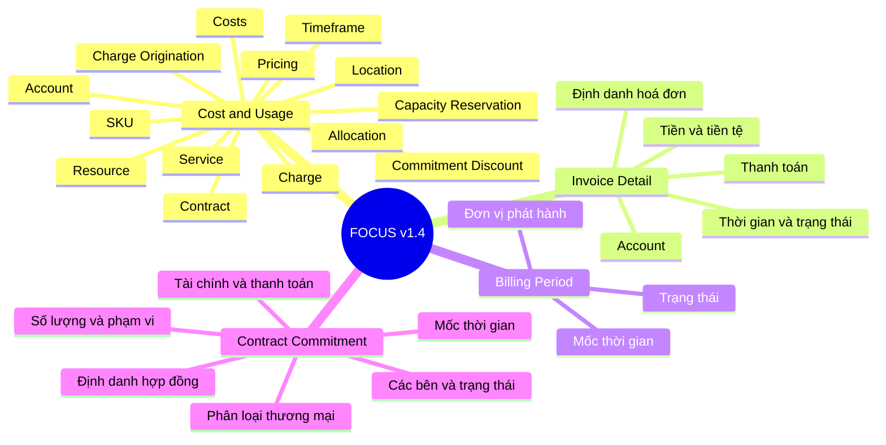

import { Callout } from 'nextra/components'

# Thư viện Cột FOCUS v1.4 — Sơ đồ tư duy

<Callout type="info" emoji="🗂️">
  Sơ đồ tư duy hệ thống hoá toàn bộ **123 cột** của FOCUS v1.4 theo 3 tầng: **dataset → nhóm cột → từng cột**. Nguồn: spec FOCUS_Spec tag `v1.4`.
</Callout>

## Tổng quan: 4 dataset → nhóm cột

<Callout type="default" emoji="🔗">
  Quan hệ join giữa các dataset xem ở [trang Giới thiệu](/finops-framework/focus-framework).
</Callout>

---

## 1. Billing Period (6 cột)

**Nhiệm vụ:** Mô tả khoảng thời gian và trạng thái của các chu kỳ billing do invoice issuer phát hành. Là dataset tra cứu để biết khi nào dữ liệu Cost and Usage / Invoice Detail của một kỳ là **sơ bộ** hay **đã chốt** — phục vụ báo cáo tài chính, showback/chargeback.

**Mốc thời gian**
- **Billing Period Start** — Mốc bắt đầu (bao gồm) của kỳ billing.
- **Billing Period End** — Mốc kết thúc (loại trừ) của kỳ billing.
- **Billing Period Created** — Thời điểm bản ghi kỳ billing được tạo lần đầu (audit vòng đời hoá đơn).
- **Billing Period Last Updated** — Thời điểm bản ghi được cập nhật gần nhất (đảm bảo đang dùng bản mới nhất).

**Trạng thái**
- **Billing Period Status** — Trạng thái kỳ ("Open"/"Closed"): dữ liệu còn thay đổi được hay đã hoàn tất.

**Đơn vị phát hành**
- **Invoice Issuer Name** — Tên đơn vị phát hành hoá đơn cho kỳ này (cũng là khoá join).

---

## 2. Contract Commitment (30 cột)

**Nhiệm vụ:** Mô tả các điều khoản hợp đồng đã thoả thuận giữa nhà cung cấp và khách hàng (cam kết chi tiêu/sử dụng, mô hình trả tiền, vòng đời, mức chiết khấu...). Cho phép **so sánh cấu trúc cam kết giữa các nhà cung cấp** trong cùng một dataset.

**Định danh hợp đồng & cam kết**
- **Contract ID** — Định danh hợp đồng do nhà cung cấp gán.
- **Contract Commitment ID** — Định danh một điều khoản cam kết cụ thể (khoá join sang Cost and Usage).
- **Contract Commitment Type** — Tên hiển thị loại cam kết theo thuật ngữ nhà cung cấp (không phải mã).
- **Contract Commitment Description** — Tóm tắt tự chứa về điều khoản cam kết khi các cột khác chưa đủ diễn đạt.

**Phân loại thương mại**
- **Contract Commitment Category** — Phân loại cao nhất theo cách cam kết được áp vào charge.
- **Contract Commitment Benefit Category** — Lợi ích chính (giảm giá / quyền dùng tính năng / đảm bảo khả dụng...).
- **Contract Commitment Offer Category** — Điều khoản công khai ("Public") hay đàm phán riêng ("Negotiated").
- **Contract Commitment Model** — Hành vi tiêu dùng: "Continuous" (use-it-or-lose-it) vs "Discontinuous" (linh hoạt theo tổng).
- **Contract Commitment Duration Type** — Độ dài danh nghĩa (vd "1 Year", "3 Years"), ổn định bất kể sự kiện vòng đời.
- **Contract Commitment Fulfillment Interval** — Khoảng để đo và reset việc hoàn thành cam kết (Continuous thường Hourly; Discontinuous Daily trở lên).

**Tài chính & thanh toán**
- **Contract Commitment Cost** — Giá trị tiền tệ của cam kết (theo dõi tiến độ hoàn thành).
- **Contract Commitment Discount Percentage** — % giảm hiệu lực so với list price cho phần được cam kết phủ.
- **Contract Commitment Payment Model** — Cấu trúc trả tiền: No Upfront / Partial Upfront / All Upfront.
- **Contract Commitment Payment Interval** — Tần suất xuất hoá đơn cho cam kết (đừng nhầm với Fulfillment Interval).
- **Contract Commitment Payment Upfront Percentage** — % tổng chi phí trả trước (dùng cho mô hình Partial Upfront).
- **Billing Currency** — Đồng tiền billing của cam kết.
- **Pricing Currency** — Đồng tiền định giá của cam kết (khi định giá và billing khác tiền tệ).
- **Pricing Currency Contract Commitment Cost** — Giá trị cam kết theo Pricing Currency (độc lập biến động tỷ giá).

**Số lượng & phạm vi áp dụng**
- **Contract Commitment Quantity** — Lượng cam kết, theo đơn vị do nhà cung cấp định nghĩa.
- **Contract Commitment Unit** — Đơn vị đo cho Contract Commitment Quantity.
- **Contract Commitment Applicability** — JSON định nghĩa thực thể đủ điều kiện được cam kết phủ (logic include/exclude).

**Mốc thời gian**
- **Contract Period Start / End** — Mốc bắt đầu (bao gồm) / kết thúc (loại trừ) của hợp đồng.
- **Contract Commitment Period Start / End** — Mốc bắt đầu/kết thúc của riêng cam kết.
- **Contract Commitment Created** — Thời điểm bản ghi cam kết được tạo lần đầu.
- **Contract Commitment Last Updated** — Thời điểm cập nhật gần nhất.

**Các bên & trạng thái**
- **Service Provider Name** — Đơn vị cung cấp resource/service, chịu trách nhiệm thực thi điều khoản cam kết.
- **Invoice Issuer Name** — Đơn vị phát hành hoá đơn cho cam kết.
- **Contract Commitment Lifecycle Status** — Trạng thái vòng đời hiện tại của cam kết (quyết định khả năng áp vào kỳ dữ liệu).

---

## 3. Cost and Usage (65 cột) — dataset chính

**Nhiệm vụ:** Mô tả chi phí và mức sử dụng phát sinh khi dùng/mua resource hoặc service. Gồm **dimensions** (định tính để lọc/nhóm) và **metrics** (số để tổng hợp). Đây là nền tảng cho hầu hết FinOps capabilities.

**Account (6) — cấu trúc tài khoản**
- **Billing Account ID** — Định danh tài khoản billing (gốc nhận hoá đơn).
- **Billing Account Name** — Tên hiển thị của tài khoản billing.
- **Billing Account Type** — Loại tài khoản billing (tên hiển thị, không phải mã).
- **Sub Account ID** — Định danh sub account (vd subscription/project) bên dưới billing account.
- **Sub Account Name** — Tên hiển thị của sub account.
- **Sub Account Type** — Loại sub account.

**Allocation (5) — phân bổ chi phí (split cost allocation)**
- **Allocated Method Details** — JSON mô tả các yếu tố quyết định việc chia tách chi phí.
- **Allocated Method ID** — Định danh phương pháp phân bổ do nhà cung cấp định nghĩa.
- **Allocated Resource ID** — Resource đích mà chi phí được phân bổ tới (khác Resource ID gốc).
- **Allocated Resource Name** — Tên hiển thị của resource đích được phân bổ.
- **Allocated Tags** — Tags áp dụng riêng cho các allocated charge.

**Costs / Billing (9) — thước đo chi phí & lượng dùng**
- **Billed Cost** — Chi phí **đã xuất hoá đơn** trong kỳ (cash-based; đối chiếu hoá đơn).
- **Effective Cost** — Chi phí **đã ghi nhận/phân bổ** trong kỳ (accrual-based; đã khấu hao prepaid/commitment).
- **List Cost** — Chi phí theo giá niêm yết = List Unit Price × Pricing Quantity (baseline tính tiết kiệm).
- **Contracted Cost** — Chi phí theo giá đã đàm phán = Contracted Unit Price × Pricing Quantity.
- **List Unit Price** — Đơn giá niêm yết, chưa giảm giá, theo Billing Currency.
- **Contracted Unit Price** — Đơn giá đã gồm negotiated discount (chưa gồm commitment discount).
- **Billing Currency** — Đồng tiền dùng để billing.
- **Consumed Quantity** — Lượng SKU thực sự tiêu thụ (theo Consumed Unit; tập trung vào tiêu dùng).
- **Consumed Unit** — Đơn vị đo lượng tiêu thụ (vd GB-Hours).

**Pricing (7) — định giá**
- **Pricing Category** — Mô hình định giá tại thời điểm dùng/mua (On-Demand, Committed...).
- **Pricing Quantity** — Lượng SKU dùng cho **tính giá** (có thể khác Consumed Quantity về granularity).
- **Pricing Unit** — Đơn vị đo dùng để xác định đơn giá (sau quy tắc như block pricing).
- **Pricing Currency** — Đồng tiền dùng để định giá (khi khác Billing Currency).
- **Pricing Currency Effective Cost** — Effective Cost quy về Pricing Currency.
- **Pricing Currency Contracted Unit Price** — Contracted Unit Price theo Pricing Currency.
- **Pricing Currency List Unit Price** — List Unit Price theo Pricing Currency.

**SKU (4) — định danh hàng hoá/dịch vụ**
- **SKU ID** — Định danh SKU (đặc tả chức năng/kỹ thuật), ổn định qua các biến thể giá.
- **SKU Meter** — Chức năng đang được đo/tính cho SKU trong charge.
- **SKU Price ID** — Định danh một mức giá cụ thể của SKU trong price list.
- **SKU Price Details** — JSON các thuộc tính giá ổn định của SKU Price (period, tier...).

**Charge (4) — bản chất khoản phí**
- **Charge Category** — Phân loại cao nhất theo cách tính phí (Usage, Purchase, Tax, Credit, Adjustment).
- **Charge Class** — Có phải là **correction** cho một kỳ đã chốt hay không.
- **Charge Description** — Mô tả tự chứa, ngắn gọn về mục đích và giá của dòng phí.
- **Charge Frequency** — Tần suất phát sinh phí (one-time, recurring, usage-based).

**Charge Origination (5) — nguồn gốc & chứng từ**
- **Service Provider Name** — Đơn vị cung cấp resource/service (trong marketplace là người bán).
- **Host Provider Name** — Đơn vị cung cấp hạ tầng nền chạy service.
- **Invoice Issuer Name** — Đơn vị phát hành hoá đơn (khoá join sang Invoice Detail/Billing Period).
- **Invoice ID** — Định danh hoá đơn chứa charge này.
- **Invoice Detail ID** — Định danh dòng chi tiết hoá đơn ứng với charge.

**Commitment Discount (8) — chiết khấu theo cam kết**
- **Commitment Discount ID** — Định danh commitment discount do nhà cung cấp gán.
- **Commitment Discount Name** — Tên hiển thị của commitment discount.
- **Commitment Discount Type** — Loại commitment discount (vd Reserved, Savings Plan).
- **Commitment Discount Category** — Cam kết dựa trên "Usage" hay "Spend".
- **Commitment Discount Status** — Charge là phần **đã dùng** hay **phần chưa dùng** của cam kết.
- **Commitment Discount Quantity** — Lượng cam kết mua/dùng (theo Commitment Discount Unit).
- **Commitment Discount Unit** — Đơn vị đo Commitment Discount Quantity.
- **Commitment Program Eligibility Details** — JSON các chương trình cam kết **có thể** phủ charge (mẫu số tính coverage).

**Contract (1) — liên kết hợp đồng**
- **Contract Applied** — JSON gắn charge với một/nhiều contract commitment (khoá join sang Contract Commitment).

**Capacity Reservation (2) — đặt trước năng lực**
- **Capacity Reservation ID** — Định danh capacity reservation.
- **Capacity Reservation Status** — Charge là phần **tiêu thụ** hay phần **chưa dùng** của reservation.

**Service (3) — phân loại dịch vụ**
- **Service Category** — Phân loại cao nhất theo chức năng cốt lõi (mỗi service đúng 1 category).
- **Service Subcategory** — Phân loại phụ trong Service Category.
- **Service Name** — Tên hiển thị của offering đã mua.

**Resource (4) — tài nguyên & gắn nhãn**
- **Resource ID** — Định danh resource do nhà cung cấp gán.
- **Resource Name** — Tên hiển thị của resource.
- **Resource Type** — Loại resource (Virtual Machine, Data Warehouse, Load Balancer...).
- **Tags** — Bộ tag (provider/user-defined) gắn business context để phân bổ chi phí.

**Location (3) — vị trí triển khai**
- **Region ID** — Định danh vùng địa lý nơi resource được cấp phát.
- **Region Name** — Tên hiển thị của vùng.
- **Availability Zone** — Khu cách ly trong Region (phân tích cost/transfer cross-zone).

**Timeframe (4) — mốc thời gian**
- **Charge Period Start** — Mốc bắt đầu (bao gồm) của charge.
- **Charge Period End** — Mốc kết thúc (loại trừ) của charge.
- **Billing Period Start** — Mốc bắt đầu (bao gồm) của kỳ billing chứa charge.
- **Billing Period End** — Mốc kết thúc (loại trừ) của kỳ billing.

---

## 4. Invoice Detail (22 cột)

**Nhiệm vụ:** Ghi nhận **chứng từ tài chính** — các khoản phí đúng như xuất hiện trên hoá đơn do invoice issuer phát hành. Phục vụ đối soát tài chính (reconciliation), khai báo thuế, xử lý thanh toán; là "cầu nối" sang bộ phận Tài chính/AP, bổ sung cho góc nhìn chi tiết của Cost and Usage.

**Định danh hoá đơn & dòng chi tiết**
- **Invoice ID** — Định danh hoá đơn (gom các charge của kỳ cho một billing account).
- **Invoice Detail ID** — Định danh một dòng chi tiết hoá đơn (map line item ↔ dữ liệu chi tiết).
- **Reference Invoice ID** — Trỏ về hoá đơn trước bị điều chỉnh (credit/refund/correction) — tạo lineage.
- **Invoice Detail Description** — Mô tả line item do invoice issuer cung cấp.
- **Invoice Detail Grain** — JSON định nghĩa độ chi tiết (grain) của line item (SKU/service/resource/custom).

**Tiền & tiền tệ**
- **Billed Cost** — Chi phí đã xuất hoá đơn (theo Billing Currency).
- **Billing Currency** — Đồng tiền billing.
- **Payment Currency** — Đồng tiền **thanh toán** invoice issuer yêu cầu (có thể khác Billing Currency).
- **Payment Currency Billed Cost** — Billed Cost quy về Payment Currency.
- **Payment Currency Invoice Detail ID** — Trỏ tới bản ghi nơi Payment Currency Billed Cost được tổng hợp.

**Thanh toán & mua hàng**
- **Payment Terms** — Điều khoản thanh toán (chủ yếu về thời hạn).
- **Payment Due Date** — Hạn cuối invoice issuer mong nhận được thanh toán.
- **Purchase Order Number** — Số PO do khách hàng cấp để map vào hồ sơ mua sắm nội bộ.

**Thời gian & trạng thái**
- **Invoice Issue Date** — Ngày phát hành hoá đơn (mốc bắt đầu payment terms).
- **Invoice Issue Status** — Trạng thái phát hành (sơ bộ / đã phát hành chính thức / đã thu hồi).
- **Billing Period Start / End** — Kỳ billing mà dòng chi tiết thuộc về.
- **Invoice Detail Created** — Thời điểm bản ghi được tạo lần đầu.
- **Invoice Detail Last Updated** — Thời điểm cập nhật gần nhất.

**Phân loại & account**
- **Charge Category** — Phân loại cao nhất theo cách tính phí.
- **Billing Account ID** — Tài khoản billing nhận hoá đơn.
- **Invoice Issuer Name** — Đơn vị phát hành hoá đơn (khoá join).

---

## Phụ lục — Quy ước chung

- **Mốc thời gian**: Start là **bao gồm** (inclusive), End là **loại trừ** (exclusive); định dạng ISO 8601 UTC.
- **Chuỗi Cost**: `List` (niêm yết) → `Contracted` (sau đàm phán) → `Effective`/`Billed` (sau commitment). So sánh để tính savings.
- **Billed vs Effective**: Billed = tiền mặt đã xuất hoá đơn theo kỳ; Effective = chi phí ghi nhận/khấu hao theo kỳ sử dụng.
- **Dimension vs Metric**: Dimension để lọc/nhóm; Metric là số để tổng hợp.
